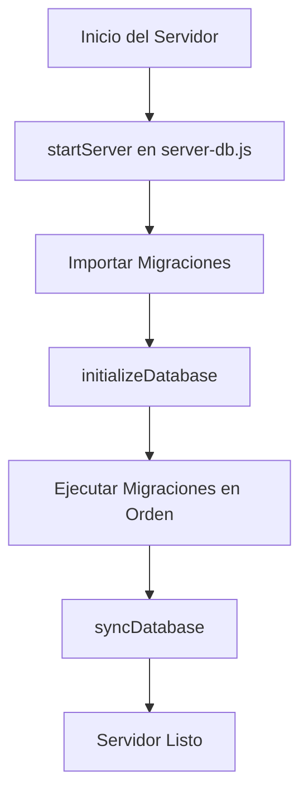

# 📘 Documentación Maestra - Transportes Araucaria

> **Última Actualización**: 16 Abril 2026
> **Versión**: 2.1

Este documento centraliza toda la información técnica, operativa y de usuario para el proyecto **Transportes Araucaria**. Reemplaza a la documentación fragmentada anterior.

---

## 📑 Índice

1. [Visión General del Proyecto](#1-visión-general-del-proyecto)
2. [Guía para Desarrolladores](#2-guía-para-desarrolladores)
3. [Arquitectura del Sistema](#3-arquitectura-del-sistema)
4. [Manual de Usuario (Panel Admin)](#4-manual-de-usuario-panel-admin)
5. [Sistemas Técnicos Detallados](#5-sistemas-técnicos-detallados)
   - [Autenticación](#51-sistema-de-autenticación)
   - [Pagos y Finanzas](#52-pagos-y-finanzas)
   - [Notificaciones](#53-notificaciones-via-email)
   - [Integraciones Externas](#54-integraciones-externas)
   - [Lógica de Disponibilidad y Anticipación](#55-lógica-de-disponibilidad-y-anticipación)
   - [Estándares de Flujos de Pago](#56-estándares-de-flujos-de-pago-y-notificaciones)
   - [Cálculo de Precios Dinámicos](#57-lógica-de-precios-y-descuentos)
   - [Sistema de Bloqueos de Fecha](#58-sistema-de-bloqueos-de-fecha)
   - [Gestión de Clientes Frecuentes](#59-gestión-de-clientes-frecuentes)
   - [Descuentos Personalizados](#510-sistema-de-descuentos-personalizados)
   - [Ajuste de Umbrales de Pasajeros](#511-ajuste-de-umbrales-de-pasajeros-por-tipo-de-vehículo)
   - [Solución UI/UX Modal](#512-solución-de-uiux-crítica-modal-de-intercepción-y-stacking-contexts)
   - [Sistema de Migraciones](#513-sistema-de-migraciones-de-base-de-datos)
   - [Historial de Transacciones](#514-sistema-de-historial-de-transacciones-flow)
   - [Gestión de Vencimiento de Códigos](#515-sistema-de-vencimiento-y-tiempos-restantes-en-códigos-de-pago)
   - [Sistema de Actualización Unificada (Bulk Update)](#516-sistema-de-actualización-unificada-bulk-update)
   - [Sistema de Oportunidades de Traslado](#517-sistema-de-oportunidades-de-traslado)
   - [Sistema de Banners Promocionales](#518-sistema-de-banners-promocionales)
   - [Sistema de Seguimiento de Conversiones (Google Ads)](#519-sistema-de-seguimiento-de-conversiones-google-ads)
   - [Mejoras en la Gestión y Visualización de Reservas (Panel Admin)](#520-mejoras-en-la-gestión-y-visualización-de-reservas-panel-admin)
   - [Sistema de Auditoría y Logs](#521-sistema-de-auditoría-y-logs-adminauditlog)
   - [Sistema de Recuperación de Detalles Incompletos](#522-sistema-de-recuperación-de-detalles-incompletos)
   - [Sistema de Recuperación de Leads Abandonados (HeroExpress)](#523-sistema-de-recuperación-de-leads-abandonados-heroexpress)
   - [Sistema de Persistencia y Robustez de Pagos](#524-sistema-de-persistencia-y-robustez-de-pagos)
   - [Almacenamiento Persistente de Imágenes (Cloudinary)](#525-almacenamiento-persistente-de-imágenes-cloudinary)
   - [Estrategia de Logs en Render](#526-estrategia-de-logs-en-render)
   - [Integración Mercado Pago Checkout Pro](#527-integración-mercado-pago-checkout-pro)

- [Configuración Dinámica de Pasarelas y Logos](#528-configuración-dinámica-de-pasarelas-y-logos-flowmercado-pago)

6. [Mantenimiento y Despliegue](#6-mantenimiento-y-despliegue)
   - [Acceso SSH a Hostinger](#61-acceso-ssh-a-hostinger-hosting-compartido)
7. [Solución de Problemas (Troubleshooting)](#7-solución-de-problemas-troubleshooting)
8. [Anexos Históricos](#8-anexos-históricos)

---

## 1. Visión General del Proyecto

### Descripción

Página web profesional y sistema de gestión para **Transportes Araucaria**, especializada en traslados desde el Aeropuerto de La Araucanía. El sistema incluye un frontend público para captación de leads/reservas y un panel administrativo completo para la gestión del negocio.

### Tecnologías Clave

- **Frontend**: React 18, Vite, Tailwind CSS, Shadcn/UI.
- **Backend**: Node.js + Express (hospedado en **Render.com**).
- **Base de Datos**: MySQL (vía Sequelize).
- **Infraestructura Legacy**: Scripts PHP para emails (hospedados en **Hostinger**).

---

## 2. Guía para Desarrolladores

### Setup Local

1. **Requisitos**: Node.js 18+, npm.
2. **Instalación**:
   ```bash
   npm install
   ```
3. **Desarrollo**:
   ```bash
   npm run dev
   ```
   _Nota: El frontend local (puerto 5173) se conecta al backend de producción en Render por defecto, salvo configuración contraria en `.env.local`._

### Variables de Entorno (`.env.local`)

```env
VITE_API_URL=https://transportes-araucaria.onrender.com
# Para desarrollo backend local:
# VITE_API_URL=http://localhost:3001
```

### Sistema de diseño frontend: shadcn/ui + Tailwind v4

- El frontend usa **shadcn/ui** con estilo `new-york`, React 18 en JSX y **Tailwind CSS v4**.
- La configuración base de shadcn vive en `components.json` y apunta a `src/App.css` como archivo CSS principal.
- Los componentes generados por shadcn deben mantenerse en `src/components/ui/` y la lógica de negocio debe componerse fuera de esa carpeta, en wrappers o componentes del dominio.
- Los tokens visuales del proyecto se definen en `src/App.css` mediante `@theme inline {}`. Para nuevas interfaces se deben priorizar tokens semánticos como `bg-primary`, `bg-secondary`, `bg-accent`, `text-foreground` y `border-border`.
- El proyecto tiene operativo el registry `@shadcn` vía MCP. Antes de agregar una pieza nueva, se debe revisar si ya existe un componente equivalente en `src/components/ui/` y luego consultar el registry para ejemplos o instalación.
- Los alias `chocolate-*` se mantienen solo por compatibilidad con módulos legacy. El sistema visual actual prioriza la paleta `forest` + `cafe`.

### Reglas de Contribución (`AGENTS.md`)

- **Idioma**: Todo en Español (código, commits, docs).
- **Archivos Protegidos**: No modificar archivos en `.github/` sin autorización.
- **PHP**: Los archivos PHP en Hostinger se despliegan **manualmente**. No sobrescribir lógica de correos sin verificar `INTEGRACION_EMAILS_PHP.md`.

### Sistema de Documentación

**Documentos Maestros Oficiales:**

- **`DOCUMENTACION_MAESTRA.md`**: Funcionalidades, arquitectura, flujos de usuario y sistemas técnicos
- **`GUIA_SOLUCION_PROBLEMAS.md`**: Troubleshooting, errores recurrentes y sus soluciones

**Workflow de Documentación:**
El proyecto incluye el workflow `/documentacion` que debe ejecutarse después de:

- Resolver un bug complejo
- Implementar una nueva funcionalidad mayor
- Modificar la arquitectura del sistema
- Detectar que la documentación está desactualizada

**Reglas Críticas para Agentes:**

1. **SIEMPRE consultar** `DOCUMENTACION_MAESTRA.md` y `GUIA_SOLUCION_PROBLEMAS.md` antes de intervenir el proyecto
2. Si el problema ya está documentado en `GUIA_SOLUCION_PROBLEMAS.md`, seguir la solución establecida
3. Después de resolver un problema nuevo, actualizar la documentación usando `/documentacion`
4. **No crear documentos nuevos** innecesarios, editar y completar los existentes

> [!IMPORTANT]
> **Para Agentes IA**: La documentación contiene soluciones a problemas recurrentes. Consultarla antes de actuar evita errores iterativos y mantiene la consistencia del proyecto.

---

## 3. Arquitectura del Sistema

### Estructura del Panel Administrativo

El panel ha sido rediseñado (v2.0) para optimizar la operación:

- **Dashboard**: KPIs en tiempo real (Ingresos, Ocupación, Reservas Hoy).
- **Operaciones**:
  - `AdminReservas`: Gestión central, vista calendario.
  - `AdminVehiculos` / `AdminConductores`: Gestión de flota y personal.
- **Finanzas**:
  - Control de gastos asociados a reservas.
  - **Estadísticas**: Panel de métricas financieras y operativas.
    - **Filtrado Inteligente**: Las estadísticas consideran **únicamente reservas completadas** para reflejar la realidad financiera.
    - **Métricas Disponibles**: Total de reservas, ingresos, gastos y utilidad neta.
    - **Filtros Temporales**: Últimos 15/30 días, mes actual, mes pasado, todo el historial o rango personalizado.
    - **Vistas**: Por conductor, por vehículo, por tipo de gasto.
  - Códigos de pago para facilitar cobros.
- **Configuración**: Tarifas base, precios dinámicos, festivos y bloqueos.
- **Marketing**: Gestión de códigos de descuento.

### Diagrama de Flujo de Datos

```mermaid
graph TD
    A[Cliente Web] -->|Reserva| B[Backend API (Render)]
    B -->|Persistencia| C[PostgreSQL]
    B -->|Webhook/Post| D[Script PHP (Hostinger)]
    D -->|SMTP| E[Email Notificación]
    A -->|Pago| F[Flow / Webpay]
    F -->|Confirmación| B
```

---

## 4. Manual de Usuario (Panel Admin)

### Acceso

- **URL**: `/admin`
- **Credenciales**: Gestionadas por SuperAdmin.

### Funcionalidades Clave

1. **Crear Reserva**:
   - Botón "Nueva Reserva".
   - Autocompletado de clientes frecuentes.
   - Cálculo automático de tarifa (incluyendo reglas dinámicas).
2. **Gestionar Estados**:
   - Estados: `Pendiente` -> `Confirmada` -> `Completada`.
   - Pagos: Registro de abonos o pagos completos.
3. **Calendario de Planificación**:
   - Vista visual de ocupación de vehículos.
   - Alertas de conflictos de horario.
4. **Configuración de Precios por Pasajero**:
   - Gestión de **porcentaje adicional** por cada pasajero extra.
   - Configuración independiente para **Autos** (1-3 pasajeros) y **Vans** (4-7 pasajeros).
   - Valores en formato decimal: `0.10` = 10% de incremento.
   - **Fórmula Auto**: `Precio Final = Base + (Pasajeros - 1) × (Base × % Adicional)`
   - **Fórmula Van**: `Precio Final = Base + (Pasajeros - 4) × (Base × % Adicional)`
   - Ejemplo Auto: $30,000 con 10% adicional → 2 pax = $33,000, 3 pax = $36,000
   - Ejemplo Van: $50,000 con 5% adicional → 4 pax = $50,000, 5 pax = $52,500, 6 pax = $55,000
5. **Gestión de Vehículos de Alta Capacidad (Vans)**:
   - **Soporte extendido**: El sistema permite reservas de hasta 7 pasajeros.
   - **Requisito de Flota**: Para aceptar reservas de 5-7 pasajeros, debe existir un vehículo tipo "Van" con capacidad 7 en `AdminVehiculos`.
   - **Asignación Manual Segura**: El sistema filtra automáticamente los vehículos en el momento de la asignación, mostrando solo aquellos con capacidad suficiente para el grupo (ej: al asignar una reserva de 6 pax, solo se mostrarán Vans, ocultando los autos pequeños).
   - **Fallback a WhatsApp**: Si un cliente intenta reservar para 5-7 pasajeros y no hay Vans disponibles, el sistema le redirige automáticamente a WhatsApp para gestión manual.

### Solución de Problemas Comunes

- **Error de Carga**: Si el panel no carga datos, verificar conexión a internet y estado de Render (puede "dormirse" en plan gratuito).
- **Emails no llegan**: Verificar carpeta SPAM y logs en `AdminEmails`.

---

## 5. Sistemas Técnicos Detallados

### 5.1 Sistema de Autenticación

Usa **JWT (JSON Web Tokens)**.

- El token se almacena en `localStorage`.
- Expiración automática.
- Middleware en backend `authenticateToken` protege las rutas críticas.

### 5.2 Pagos y Finanzas

- **Integración Flow**: Para pagos con tarjetas chilenas.
- **Códigos de Pago**: Sistema propio para generar links de pago únicos.
  - **Vencimiento Inteligente**: Los códigos se marcan automáticamente como "vencido" al expirar.
  - **Feedback Visual**: Contadores de tiempo restante con alertas por colores según urgencia.
  - **Asociación Directa**: Vinculación a reservas existentes para cobro de saldos.
- **Validación de Datos**:
  - **Emails**: Se aplica sanitización robusta (vía `sanitizarEmailRobusto`) y validación de formato Regex antes de cualquier interacción con Flow para prevenir el error 1620.

### 5.3 Notificaciones vía Email

El sistema utiliza una arquitectura híbrida:

1. **Backend Node** recibe la solicitud de envío.
2. **Backend Node** hace POST a script PHP en Hostinger.
3. **PHP** utiliza `PHPMailer` autenticado para el envío final.
   _Archivos Clave_: `enviar_asignacion_reserva.php` (Pasajero) y `enviar_notificacion_conductor.php` (Conductor).

#### 5.3.1 Notificaciones para Reservas de Tramos Vinculados (Ida y Vuelta)

**Implementado: Febrero 2026**

Para mejorar la claridad en reservas de ida y vuelta (donde la reserva se divide en dos registros independientes), se implementó una lógica de notificaciones con contexto:

1.  **Regla de Notificación**: Cada tramo se notifica de forma independiente en el momento de su asignación. Esto permite flexibilidad si no se conocen ambos conductores al mismo tiempo.
2.  **Contexto en el Correo de Vuelta**:
    - Si se asigna el tramo de **VUELTA** y el tramo de **IDA** ya tiene conductor/vehículo asignado, el correo al pasajero incluirá automáticamente una sección de "✈️ Viaje de Ida (ya confirmado)" arriba del viaje actual.
    - Esto garantiza que el cliente tenga siempre a mano la información completa del servicio unificado.
3.  **Notificación al Conductor**:
    - Si el **mismo conductor** es asignado a ambos tramos, recibirá un correo unificado con los detalles de la ida y la vuelta.
    - El archivo `.ics` (calendario) adjunto contendrá **dos eventos** (ida y vuelta) para facilitar su agendamiento.
    - Si son conductores distintos, cada uno recibe su notificación individual por el tramo que le corresponde.

### 5.4 Integraciones Externas

- **Google Ads**: Conversiones mejoradas implementadas en flujos de pago.
  - **Tracking Robusto**: El backend (`/api/payment-result`) inyecta el monto real de la transacción en la URL de retorno, garantizando que el tag de conversión (`gtag`) reciba el valor correcto incluso si falla la consulta de base de datos local.
- **Google Maps**: Autocomplete de direcciones mediante `AddressAutocomplete`, implementado con Places API (New) por HTTP para mantener control total del input en React y evitar inconsistencias del Web Component en edición y selección de direcciones. El valor persistido debe conservar el texto seleccionado por el usuario desde Google cuando represente un lugar o hotel, para que los enlaces enviados a conductor apunten al sitio correcto y no solo a la calle formateada.

### 5.5 Lógica de Disponibilidad y Anticipación

### 5.5.1 Capacidad Extendida (Vans)

Se implementó soporte para hasta 7 pasajeros con una lógica de fallback híbrida:

1.  **Backend (`/api/disponibilidad/verificar`)**:
    - Recibe `pasajeros` y filtra vehículos con `capacidad >= pasajeros`.
    - Retorna `disponible: false` si no encuentra vehículos adecuados en el horario.

2.  **Frontend (`Hero.jsx` / `HeroExpress.jsx`)**:
    - Consume el endpoint de verificación.
    - **Lógica de Fallback**: Si el endpoint retorna `false` y el grupo es de 5-7 personas (Vans), se intercepta el bloqueo estándar y se muestra un componente `WhatsAppButton`.
    - Esto permite capturar leads de grupos grandes incluso sin disponibilidad automática configurada.

3.  **Componentes Reutilizables**:
    - `WhatsAppButton.jsx`: Centraliza la lógica de contacto + Tracking de Google Ads. Usar este componente para cualquier nuevo punto de contacto.

4.  **Panel de Administración**:
    - En `AdminReservas`, el selector de vehículos filtra automáticamente por capacidad en el frontend: `vehiculos.filter(v => capacity >= required)`.
    - Esto previene errores operativos de asignación de vehículos pequeños a grupos grandes.

### 5.5.2 Restricción de Anticipación Mínima

**Implementado: Enero 2026**

El sistema implementa una doble validación para evitar reservas de "último minuto" que son operativamente inviables:

1.  **Modelo de Datos**: Cada `Destino` tiene un campo `minHorasAnticipacion` (configurable desde el Admin). Por defecto 5 horas.
2.  **Validación Frontend**:
    - **Filtrado Visual**: En `HeroExpress.jsx`, si el usuario selecciona HOY, se ocultan del selector las horas que violan la restricción.
  - **Selectores Enriquecidos**: El flujo público usa `Select` de shadcn para origen, destino, hora y pasajeros, mostrando resúmenes dinámicos de trayecto y servicio sugerido según la ruta elegida.
    - **Bloqueo Lógico**: Al intentar avanzar al paso de pago, se recalcula la diferencia horaria y se bloquea el avance si no cumple.
  - **Servicios Especiales**: Si `configSillas.habilitado` está activo, `HeroExpress.jsx` expone la solicitud de sillas infantiles y envía la cantidad seleccionada a la cotización backend.

### 5.6 Estándares de Flujos de Pago y Notificaciones

Para garantizar la consistencia operativa y del marketing (Google Ads), se han estandarizado los 3 flujos de reserva. Toda modificación futura **debe respetar estas directrices**:

#### A. Módulo Principal (Express)

- **Ruta**: Home → Cotización → Pago → `CompletarDetalles.jsx`.
- **Captura de Dirección**:
  - Obligatorio usar `AddressAutocomplete` en el campo `hotel` dentro de `CompletarDetalles.jsx`.
  - **Validación Frontend**: El componente valida que el campo no esté vacío antes de enviar (líneas 161-166).
  - **Validación Backend**: El endpoint `/completar-reserva-detalles` retorna error HTTP 400 si falta la dirección.
- **Notificaciones**:
  1.  **Pago**: Webhook (`/api/flow-confirmation`) notifica el dinero recibido (Admin + Cliente).
  2.  **Logística**: Al guardar detalles en `PUT /completar-reserva-detalles`, se dispara la notificación logística (Admin + Cliente).
- **Tracking**: La conversión se dispara en `App.jsx` al retornar de Flow, usando los parámetros `amount` y `d` (datos de usuario encriptados).
- **Consentimiento Legal**: El paso de pago en `HeroExpress.jsx` debe mantener accesibles los modales de `Términos y Condiciones` y `Política de Privacidad` antes de aceptar la casilla de consentimiento.

#### B. Pagar con Código

- **Escenarios**:
  1.  **Nueva Reserva**: Crea una reserva express con los datos del código.
  2.  **Pago de Saldo/Diferencia**: Paga un monto vinculado a una reserva existente (`reservaVinculadaId`).
- **Ruta**: Usuario ingresa código → Vista (Formulario Completo o Resumen Vinculado) → Pago → `FlowReturn.jsx`.
- **Captura de Dirección**:
  - Obligatorio usar `AddressAutocomplete` en el formulario inicial de `PagarConCodigo.jsx`.
  - Campos condicionales: `direccionDestino` (viajes DESDE aeropuerto) o `direccionOrigen` (viajes HACIA aeropuerto).
  - **Validación Frontend**: El componente valida según sentido del viaje (líneas 196-212).
  - **Mapeo Inteligente Backend**: El endpoint `/enviar-reserva-express` determina automáticamente qué dirección usar y la guarda en el campo `hotel` (líneas 2793-2815).
- **Notificaciones**:
  1.  **Logística**: Ocurre al crear la reserva inicial (`POST /enviar-reserva-express`).
  2.  **Pago**: Webhook (`/api/flow-confirmation`) notifica solo el pago (el sistema detecta que es flujo de código y evita duplicar la logística).
- **Actualización de Código**:
  - El webhook localiza el código mediante `codigoPagoId` (prioritario) o `referenciaPago` y lo marca como **usado** automáticamente tras el pago exitoso.
- **Tracking**: La conversión se dispara en `FlowReturn.jsx` usando los parámetros `amount` y `d`.

#### C. Consultar Reserva / Pagos Pendientes

- **Ruta**: #consultar-reserva → Ver Estado → Pagar Saldo → `FlowReturn.jsx`.
- **Notificaciones**: Solo notificación de pago (Financiera).
- **Tracking**: Conversión en `FlowReturn.jsx` con monto del abono o saldo pagado.

#### 🛠️ Directrices Técnicas Generales

1.  **Regla de Oro: División entre Logística y Referencia**:
    - **Principio**: Se deben capturar dos datos distintos para evitar ambigüedades.
    - **Dirección Específica (Logística)**: Capturada vía `AddressAutocomplete` (Google Maps). Se almacena internamente en `direccionOrigen` o `direccionDestino` para navegación y visualización en Ruta.
    - **Referencia / Hotel (Opcional)**: Campo de texto libre para detalles descriptivos (ej: "Dpto 402", "Casa Amarilla"). Se almacena en el campo `hotel`.
    - **Mapeo Automático**: El backend determina si la dirección de Google corresponde al origen o destino basándose en el sentido del viaje respecto al aeropuerto.
    - **Notificación Conductor**: El mensaje concatena ambos datos para máxima precisión: `Ruta (Dirección Google) [Referencia]`.

2.  **Google Ads (Conversiones Avanzadas)**:
    - **Backend**: El endpoint de redirección (`/api/payment-result`) siempre debe inyectar el parámetro `d` en la URL de retorno. Este parámetro es un JSON Base64 con `{email, nombre, telefono}`.
    - **Frontend**: El tag de conversión `gtag` debe incluir siempre `email`, `phone_number` y `address` (mapeado desde el nombre) para mejorar la precisión de Google Ads.
3.  **Protección de Duplicados**: Usar siempre `sessionStorage` con una clave única (`flow_conversion_[transactionId]`) antes de disparar `gtag` para evitar conversiones dobles en recargas de página.
4.  **Campo Maestro de Dirección**: El campo `hotel` en la base de datos es el contenedor para direcciones precisas capturadas por Google Maps. Nunca usar campos de texto simple para direcciones finales si el componente permite el autocomplete.
5.  **PHP Integration**: Los scripts de Hostinger esperan `hotel`, `idaVuelta`, `fechaRegreso` y `horaRegreso` para una operación fluida. Asegurar que el backend siempre los propague en los payloads de `axios`.

#### 🔧 Implementación de Validación y Mapeo de Direcciones

**Actualización: 2 Enero 2026**

Se implementó validación obligatoria y mapeo inteligente de direcciones en ambos flujos principales:

**Flujo A (Express)**:

- **Frontend** (`CompletarDetalles.jsx` líneas 161-166): Validación antes de enviar formulario.
- **Backend** (`/completar-reserva-detalles` línea 3614): Retorna HTTP 400 si falta dirección.
- **Guardado**: Directo al campo `hotel` con `.trim()` para limpiar espacios.

**Flujo B (Pagar con Código)**:

- **Frontend** (`PagarConCodigo.jsx` líneas 196-212): Validación condicional según sentido del viaje.
- **Backend** (`/enviar-reserva-express` líneas 2793-2815): Lógica inteligente de mapeo:
  ```javascript
  // Determina automáticamente la dirección específica
  if (origenEsAeropuerto && direccionDestinoCliente) {
  	direccionEspecifica = direccionDestinoCliente; // Viaje DESDE aeropuerto
  } else if (destinoEsAeropuerto && direccionOrigenCliente) {
  	direccionEspecifica = direccionOrigenCliente; // Viaje HACIA aeropuerto
  }
  ```
- **Guardado**: Mapeo inteligente al campo `hotel` según sentido del viaje.

**Resultado**: Ambos flujos garantizan que el campo `hotel` (Dirección Específica) esté siempre poblado antes de confirmar una reserva, cumpliendo con la "Regla de Oro".

### 5.7 Sistema de Estadísticas Financieras

El panel de estadísticas (`AdminEstadisticas.jsx`) proporciona métricas clave para la toma de decisiones operativas y financieras.

#### Principio Fundamental: Solo Reservas Completadas

**Desde Diciembre 2025**, el sistema filtra **únicamente reservas con estado `completada`** en todos los cálculos estadísticos. Esto garantiza que:

- Los ingresos reflejen dinero realmente recibido
- Los gastos correspondan a servicios ejecutados
- La utilidad sea precisa y accionable

#### Implementación Técnica

**Backend** (`server-db.js`):

- Endpoints modificados: `/api/estadisticas/conductores`, `/api/estadisticas/vehiculos`, `/api/estadisticas/conductores/:id`
- Filtro aplicado: `{ estado: "completada" }` en todas las consultas de reservas
- Líneas clave: 7587-7590, 7714-7717, 7953-7956

```javascript
const whereReservas =
	fechaInicio || fechaFin
		? { fecha: filtroReservas, estado: "completada" }
		: { estado: "completada" };
```

**Frontend** (`AdminEstadisticas.jsx`):

- No requiere cambios, consume los datos filtrados del backend
- Cálculo de totales: `calcularTotales()` suma métricas de conductores/vehículos
- Visualización: Cards con Total Reservas, Total Ingresos, Total Gastos, Utilidad

#### Métricas Disponibles

| Vista           | Métricas                                                                       |
| --------------- | ------------------------------------------------------------------------------ |
| **Conductores** | Reservas completadas, ingresos, gastos, pagos al conductor, utilidad           |
| **Vehículos**   | Reservas completadas, ingresos, gastos de combustible, mantenimiento, utilidad |
| **Gastos**      | Total por período, registros, desglose por tipo (combustible, peajes, etc.)    |

#### Filtros Temporales

- Últimos 15 días
- Últimos 30 días (predeterminado)
- Mes actual
- Mes pasado
- Todo el historial
- Rango personalizado

> [!IMPORTANT]
> **Cambio de Comportamiento**: Antes de Diciembre 2025, las estadísticas incluían todas las reservas (pendientes, canceladas, etc.), lo que inflaba los números. Ahora solo se consideran reservas cerradas para reflejar la realidad operativa.

### 5.8 Sistema de Reservas Ida y Vuelta (Tramos Separados)

**Implementado: Diciembre 2025**  
**Actualizado: 13 Enero 2026** (Fix para flujo Express)

Para resolver problemas de asignación de conductores distintos para la ida y la vuelta, y permitir cierres de caja parciales, se implementó un cambio estructural en cómo se manejan los viajes redondos.

#### Lógica de Negocio

Cuando un usuario (o admin) crea una reserva de tipo "Ida y Vuelta":

1.  **Backend**: El sistema intercepta la creación y genera **DOS** registros en la base de datos:
    - **Registro A (Ida)**: Contiene los datos del viaje de ida.
    - **Registro B (Vuelta)**: Contiene los datos de regreso (origen/destino invertidos).
2.  **Vinculación**: Ambos registros quedan unidos mediante los campos `tramoPadreId` y `tramoHijoId`.
3.  **División de Costos**: El precio total y los abonos se dividen **50/50** entre ambos tramos.
    - _Ejemplo_: Reserva de $40.000. Se crean dos reservas de $20.000 cada una.
4.  **Independencia Operativa**:
    - Cada tramo puede tener su propio **Conductor** y **Vehículo**.
    - Cada tramo puede tener su propio estado de pago y estado de ejecución (`Confirmada` vs `Completada`).

#### Implementación Técnica

**Endpoints con lógica de separación:**

- ✅ `/enviar-reserva` (líneas 2646-2752): Implementado desde Diciembre 2025
- ✅ `/enviar-reserva-express` (líneas 3380-3499): **Implementado 13 Enero 2026**

**Flujos que usan la separación:**

- ✅ Pagar con Código → `/enviar-reserva-express`
- ✅ Cualquier flujo que use `/enviar-reserva-express`

> [!IMPORTANT]
> **Fix Crítico (13 Enero 2026)**: Se detectó que el endpoint `/enviar-reserva-express` (usado por "Pagar con Código") NO tenía la lógica de separación, causando que todas las reservas ida y vuelta quedaran como una sola. Este problema fue corregido copiando la lógica de separación al endpoint express. Ver `GUIA_SOLUCION_PROBLEMAS.md` sección 1 para detalles.

#### Impacto en Panel Admin (`AdminReservas`)

- **Visualización**: Las reservas aparecen como filas separadas.
- **Identificadores**:
  - Badge **IDA** (Verde): Indica el primer tramo.
  - Badge **RETORNO** (Azul): Indica el segundo tramo.
- **Acciones**: Puede completar y cerrar la "Ida" (y registrar sus gastos) mientras la "Vuelta" permanece pendiente para días futuros.

> **Nota**: Desde Feb 2026, la vista principal **oculta por defecto** las reservas de tipo "Vuelta" para evitar duplicados en la lista. Se accede a ellas a través de la reserva de "Ida" vinculada.

> **Nota Legacy**: Las reservas antiguas (creadas antes de este cambio) mantienen el comportamiento "Legacy" (una sola fila para todo el viaje) y se identifican con el badge **IDA Y VUELTA**.

#### Script de Diagnóstico de Tramos

**Creado: 10 Febrero 2026**

Para verificar la integridad de los datos de reservas ida/vuelta y detectar posibles problemas de asignación de `tipoTramo`, se creó un script de diagnóstico reutilizable.

**Archivo**: [`backend/diagnosticar-tipo-tramo.js`](file:///c:/Users/widom/Documents/web}/transportes-araucaria/backend/diagnosticar-tipo-tramo.js)

**Funcionalidades**:

1. Verifica la existencia de la columna `tipo_tramo` en la base de datos
2. Muestra la distribución de reservas por tipo ('ida', 'vuelta', 'solo_ida')
3. Lista las últimas 10 reservas vinculadas con sus tipos y relaciones
4. Detecta automáticamente problemas de integridad:
   - Reservas hijas (con `tramoPadreId`) que NO sean tipo 'vuelta'
   - Reservas padres (con `tramoHijoId`) que NO sean tipo 'ida'

**Uso**:

```bash
cd backend
node diagnosticar-tipo-tramo.js
```

**Hallazgos del Último Diagnóstico (10 Feb 2026)**:

- ✅ La columna `tipo_tramo` existe y está correctamente configurada
- ✅ Todas las reservas vinculadas tienen tipos correctos asignados
- ✅ No se detectaron inconsistencias en los datos actuales
- ℹ️ El sistema está funcionando correctamente desde la implementación

> [!TIP]
> **Para Troubleshooting**: Si un usuario reporta problemas con reservas ida/vuelta, ejecutar primero este script de diagnóstico para verificar si el problema está en los datos (backend) o en la visualización (frontend).

### 5.9 Optimización del Modal de Detalles de Reserva

**Implementado: 2 Enero 2026**

Para mejorar la experiencia de usuario en el panel administrativo, se optimizó el modal "Ver Detalles" de reservas para ocultar campos vacíos y concentrar la información relevante.

#### Problema Identificado

El modal mostraba todos los campos posibles, incluso cuando estaban vacíos (con guiones "-" o valores en $0). Esto dificultaba la lectura rápida de información importante, especialmente en reservas con datos mínimos.

#### Solución Implementada

Se implementó **renderizado condicional** en `AdminReservas.jsx` para mostrar solo campos con contenido real.

#### Campos Optimizados

**Detalles del Viaje:**

- `vehiculo`: Solo se muestra si está asignado

**Información Adicional:**

- Sección completa se oculta si todos los campos están vacíos
- `numeroVuelo`: Solo si tiene valor
- `hotel`: Solo si tiene valor
- `equipajeEspecial`: Solo si tiene valor
- `sillaInfantil`: Solo si es `true` (muestra "Sí")

**Información Financiera:**

- `descuentoBase`: Solo si > 0
- `descuentoPromocion`: Solo si > 0
- `descuentoRoundTrip`: Solo si > 0
- `descuentoOnline`: Solo si > 0
- `codigoDescuento`: Solo si tiene valor

**Estado y Pago:**

- `metodoPago`: Solo si tiene valor
- `referenciaPago`: Solo si tiene valor

**Información Técnica:**

- `ipAddress`: Solo si tiene valor

#### Implementación Técnica

**Archivo**: `src/components/AdminReservas.jsx`

**Patrón de Código**:

```jsx
// Para campos de texto/string
{
	selectedReserva.campo && (
		<div>
			<Label>Etiqueta</Label>
			<p>{selectedReserva.campo}</p>
		</div>
	);
}

// Para campos numéricos (descuentos)
{
	selectedReserva.descuento > 0 && (
		<div>
			<Label>Descuento</Label>
			<p>{formatCurrency(selectedReserva.descuento)}</p>
		</div>
	);
}

// Para secciones completas
{
	(campo1 || campo2 || campo3) && (
		<div>
			<h3>Sección</h3>
			{/* Campos individuales con sus propias condiciones */}
		</div>
	);
}
```

**Líneas Modificadas**: 3173-3178, 3303-3348, 3354-3393, 3448-3455, 3477-3495, 3535-3540

#### Beneficios

- ✅ **Claridad Visual**: Solo información relevante
- ✅ **Lectura Rápida**: Menos scroll, más concentración
- ✅ **Profesionalismo**: Interfaz limpia y ordenada
- ✅ **Mantenibilidad**: Patrón claro para futuros campos

> [!TIP]
> **Para Futuros Desarrolladores**: Si agregas nuevos campos al modal de detalles, sigue el patrón de renderizado condicional mostrado arriba. Pregúntate: "¿Este campo puede estar vacío o en 0?" Si la respuesta es sí, envuélvelo en una condición.

### 5.9.1 Mejora Visual de Reservas Ida y Vuelta en Modal de Detalles

**Implementado: 23 Enero 2026**

Se implementó una mejora significativa en la visualización de reservas de ida y vuelta en todos los modales de detalle del sistema, para hacer la información más clara y evitar confusiones operativas.

#### Problema Identificado

Cuando una reserva era de tipo **ida y vuelta** (`idaVuelta === true`), la información del viaje de regreso (fecha y hora de vuelta) no se mostraba de manera prominente. Los campos `fechaRegreso` y `horaRegreso` aparecían mezclados con otros datos, lo que dificultaba:

- Identificar rápidamente que era un viaje de ida y vuelta
- Visualizar claramente las fechas y horas de ambos viajes
- Detectar cuando faltaba información del viaje de regreso

#### Solución Implementada

Se implementó un **diseño visual mejorado con separación por colores** que distingue claramente entre el viaje de ida y el viaje de vuelta:

**Características Principales:**

1. **Indicador Visual del Tipo de Viaje**: Badge azul que indica "Viaje Ida y Vuelta"
2. **Tarjeta Verde para Viaje de Ida**: Con borde izquierdo verde, fondo degradado verde claro
3. **Tarjeta Azul para Viaje de Vuelta**: Con borde izquierdo azul, fondo degradado azul claro
4. **Iconos SVG Direccionales**: Flecha derecha (→) para ida, flecha izquierda (←) para vuelta
5. **Advertencia Visual**: Alert amarillo cuando falta `fechaRegreso` o `horaRegreso`
6. **Información de Direcciones**: Se mantiene visible en ambas tarjetas cuando existe

#### Archivos Modificados

**1. AdminReservas.jsx** (Líneas ~3173-3297)

```jsx
{
	/* Indicador del tipo de viaje */
}
{
	selectedReserva.idaVuelta && (
		<div className="mb-4 inline-flex items-center gap-2 bg-blue-50 text-blue-700 px-3 py-1.5 rounded-full border border-blue-200">
			<svg
				className="w-4 h-4"
				fill="none"
				stroke="currentColor"
				viewBox="0 0 24 24"
			>
				<path
					strokeLinecap="round"
					strokeLinejoin="round"
					strokeWidth={2}
					d="M8 7h12m0 0l-4-4m4 4l-4 4m0 6H4m0 0l4 4m-4-4l4-4"
				/>
			</svg>
			<span className="font-semibold text-sm">Viaje Ida y Vuelta</span>
		</div>
	);
}

{
	/* Viaje de Ida - Tarjeta Verde */
}
<div className="bg-gradient-to-r from-green-50 to-green-100 border-l-4 border-green-500 rounded-lg p-4 mb-4">
	<h4 className="font-semibold text-green-800 mb-3 flex items-center gap-2">
		<svg
			className="w-5 h-5"
			fill="none"
			stroke="currentColor"
			viewBox="0 0 24 24"
		>
			<path
				strokeLinecap="round"
				strokeLinejoin="round"
				strokeWidth={2}
				d="M17 8l4 4m0 0l-4 4m4-4H3"
			/>
		</svg>
		VIAJE DE IDA
	</h4>
	{/* Contenido del viaje de ida */}
</div>;

{
	/* Viaje de Vuelta - Tarjeta Azul con Advertencia */
}
{
	selectedReserva.idaVuelta && (
		<div className="bg-gradient-to-r from-blue-50 to-blue-100 border-l-4 border-blue-500 rounded-lg p-4 mb-4">
			<h4 className="font-semibold text-blue-800 mb-3 flex items-center gap-2">
				<svg
					className="w-5 h-5"
					fill="none"
					stroke="currentColor"
					viewBox="0 0 24 24"
				>
					<path
						strokeLinecap="round"
						strokeLinejoin="round"
						strokeWidth={2}
						d="M7 16l-4-4m0 0l4-4m-4 4h18"
					/>
				</svg>
				VIAJE DE VUELTA
			</h4>
			{/* Contenido del viaje de vuelta */}

			{/* Advertencia si falta información */}
			{(!selectedReserva.fechaRegreso || !selectedReserva.horaRegreso) && (
				<div className="mt-3 bg-yellow-50 border border-yellow-200 rounded-lg p-3 flex items-start gap-2">
					<svg
						className="w-5 h-5 text-yellow-600 flex-shrink-0 mt-0.5"
						fill="none"
						stroke="currentColor"
						viewBox="0 0 24 24"
					>
						<path
							strokeLinecap="round"
							strokeLinejoin="round"
							strokeWidth={2}
							d="M12 9v2m0 4h.01m-6.938 4h13.856c1.54 0 2.502-1.667 1.732-3L13.732 4c-.77-1.333-2.694-1.333-3.464 0L3.34 16c-.77 1.333.192 3 1.732 3z"
						/>
					</svg>
					<div>
						<p className="text-sm font-semibold text-yellow-800">
							Información Incompleta del Viaje de Vuelta
						</p>
						<p className="text-xs text-yellow-700 mt-1">
							Es necesario completar la fecha y hora del regreso para coordinar
							el servicio.
						</p>
					</div>
				</div>
			)}
		</div>
	);
}
```

**2. ConsultarReserva.jsx** (Líneas ~399-466)

- Mismas mejoras visuales adaptadas para la vista del cliente
- Mensaje de advertencia adaptado: "Nos comunicaremos contigo para confirmar la fecha y hora del regreso"

**3. AdminEstadisticas.jsx** (Líneas ~1400-1438)

- Diseño compacto adaptado al modal más pequeño
- Mantiene la misma lógica de separación visual por colores

#### Esquema de Colores

| Elemento           | Color/Estilo                                             | Propósito                                |
| ------------------ | -------------------------------------------------------- | ---------------------------------------- |
| Badge Ida y Vuelta | `bg-blue-50 text-blue-700 border-blue-200`               | Indicador general del tipo de viaje      |
| Tarjeta de Ida     | `from-green-50 to-green-100 border-l-4 border-green-500` | Viaje de ida destacado en verde          |
| Tarjeta de Vuelta  | `from-blue-50 to-blue-100 border-l-4 border-blue-500`    | Viaje de vuelta destacado en azul        |
| Advertencia        | `bg-yellow-50 border-yellow-200`                         | Información faltante del viaje de vuelta |

#### Beneficios

- ✅ **Claridad Operativa**: Los operadores identifican inmediatamente los viajes de ida y vuelta
- ✅ **Reducción de Errores**: La información de ambos viajes es claramente visible
- ✅ **Detección de Datos Faltantes**: Alertas visuales cuando falta información crítica
- ✅ **Experiencia de Usuario**: Interfaz intuitiva con códigos de color consistentes
- ✅ **Responsive**: Funciona correctamente en móvil y desktop
- ✅ **Consistencia**: Mismo patrón visual en todos los modales del sistema

#### Datos Mostrados por Tarjeta

**Tarjeta de Ida (Verde):**

- Origen
- Destino
- Dirección de Origen (si existe)
- Dirección de Destino (si existe)
- Fecha del viaje
- Hora de recogida

**Tarjeta de Vuelta (Azul):**

- Origen (que es el destino original invertido)
- Destino (que es el origen original invertido)
- Fecha de regreso (con advertencia si no existe)
- Hora de regreso (con advertencia si no existe)

**Información Adicional (Fuera de tarjetas):**

- Número de pasajeros
- Vehículo asignado (si existe)

> [!IMPORTANT]
> **Para Mantenimiento Futuro**: Si se agregan nuevos campos relacionados con el viaje de regreso, asegúrate de:
>
> 1. Incluirlos dentro de la tarjeta azul de vuelta
> 2. Agregar validación en la advertencia si son campos críticos
> 3. Mantener la consistencia de colores (azul para vuelta, verde para ida)

> [!TIP]
> **Mejora Sugerida para el Futuro**: Considerar agregar validaciones en el backend para requerir `fechaRegreso` y `horaRegreso` cuando `idaVuelta === true` antes de permitir que una reserva pase a estado "Confirmada".

### 5.10 Sistema de Descuentos Personalizados

**Implementado: Enero 2026**

El sistema permite configurar descuentos adicionales por tramo/destino con restricciones específicas de días y horarios. Estos descuentos se **suman** a los descuentos globales (online, ida y vuelta, promociones) en el cálculo del precio final.

#### Características Principales

- **Múltiples descuentos simultáneos**: Se pueden configurar varios descuentos personalizados que se suman entre sí
- **Aplicación por tramo**: Los descuentos se calculan sobre el precio de cada tramo individual
- **Duplicación automática**: En viajes ida y vuelta, el descuento se aplica a ambos tramos
- **Activación/desactivación**: Cada descuento puede activarse o desactivarse sin eliminarlo
- **Restricciones opcionales**: Por días de la semana y rangos horarios

#### Flujo de Datos Completo

**1. Almacenamiento (Backend)**

**Archivo**: [`backend/server-db.js`](file:///c:/Users/widom/Documents/web}/transportes-araucaria/backend/server-db.js)  
**Líneas**: 1114, 1130-1137, 1319-1335

Los descuentos se almacenan en la tabla `DescuentoGlobal` con `tipo: "descuentoPersonalizado"`.

```javascript
// Formateo para envío al frontend
descuentosFormatted.descuentosPersonalizados = [];

descuentosGlobales.forEach((descuento) => {
	if (descuento.tipo === "descuentoPersonalizado") {
		descuentosFormatted.descuentosPersonalizados.push({
			nombre: descuento.nombre,
			valor: descuento.valor, // Porcentaje (ej: 10 = 10%)
			activo: descuento.activo, // Boolean
			descripcion: descuento.descripcion,
		});
	}
});
```

**Endpoint**: `GET /pricing` retorna los descuentos en `descuentosGlobales.descuentosPersonalizados`

**2. Cálculo del Porcentaje Total (Frontend)**

**Archivo**: [`src/App.jsx`](file:///c:/Users/widom/Documents/web}/transportes-araucaria/src/App.jsx)  
**Líneas**: 1002-1006

```javascript
// Suma todos los descuentos personalizados activos
const personalizedDiscountRate =
	descuentosGlobales?.descuentosPersonalizados
		?.filter((desc) => desc.activo && desc.valor > 0)
		.reduce((sum, desc) => sum + desc.valor / 100, 0) || 0;
```

**Ejemplo**: Si hay descuentos de 10% y 5% activos → `personalizedDiscountRate = 0.15`

**3. Aplicación al Precio por Tramo**

**Archivo**: [`src/App.jsx`](file:///c:/Users/widom/Documents/web}/transportes-araucaria/src/App.jsx)  
**Líneas**: 1308-1314

```javascript
// Calcular descuento sobre precio de un tramo
const descuentosPersonalizadosPorTramo = Math.round(
	precioIda * personalizedDiscountRate,
);

// Duplicar si es ida y vuelta
const descuentosPersonalizados = formData.idaVuelta
	? descuentosPersonalizadosPorTramo * 2
	: descuentosPersonalizadosPorTramo;
```

**4. Inclusión en el Total Final**

**Archivo**: [`src/App.jsx`](file:///c:/Users/widom/Documents/web}/transportes-araucaria/src/App.jsx)  
**Líneas**: 1360-1373

```javascript
// Suma de todos los descuentos
const descuentoTotalSinLimite =
	descuentoOnline +
	descuentoPromocion +
	descuentoRoundTrip +
	descuentosPersonalizados + // ← Incluido aquí
	descuentoCodigo +
	descuentoRetornoUniversal;

// Límite máximo del 75% del precio base
const descuentoMaximo = Math.round(precioBase * 0.75);
const descuentoOnlineTotal = Math.min(descuentoTotalSinLimite, descuentoMaximo);

// Precio final
const totalConDescuento =
	Math.max(precioBase - descuentoOnlineTotal, 0) + costoSilla;
```

#### Visualización en la Interfaz

**Archivo**: [`src/components/Hero.jsx`](file:///c:/Users/widom/Documents/web}/transportes-araucaria/src/components/Hero.jsx)

Los descuentos personalizados se muestran en 3 ubicaciones:

1. **Texto principal** (líneas 669-672): Descripción en el hero
2. **Módulo de reserva** (líneas 759-764): Texto destacado en el formulario
3. **Badge visual** (líneas 803-810): Etiqueta morada "Especial +X%"

```jsx
{
	personalizedDiscountPercentage > 0 && (
		<Badge variant="default" className="bg-purple-500">
			Especial +{personalizedDiscountPercentage}%
		</Badge>
	);
}
```

#### Ejemplo de Cálculo Completo

```
Escenario: Viaje ida y vuelta, Temuco → Aeropuerto
Precio base por tramo: $30,000
Descuentos configurados:
  - Online: 5%
  - Personalizado 1 (Temuco): 10%
  - Ida y vuelta: 10%

Cálculo:
  Precio base total (ida + vuelta): $60,000

  Descuentos por tramo:
    - Online (5% × $30,000 × 2): -$3,000
    - Personalizado (10% × $30,000 × 2): -$6,000

  Descuentos sobre total:
    - Ida y vuelta (10% × $60,000): -$6,000

  Total descuentos: $15,000 (25% del total)
  Precio final: $45,000
```

#### Gestión en Panel Admin

**Componente**: [`AdminPricing.jsx`](file:///c:/Users/widom/Documents/web}/transportes-araucaria/src/components/AdminPricing.jsx)

**Funciones clave**:

- `addDescuentoPersonalizado()` (línea 477): Agregar nuevo descuento
- `handleDescuentoPersonalizadoChange()` (línea 497): Editar descuento
- `toggleDescuentoPersonalizado()` (línea 531): Activar/desactivar
- `removeDescuentoPersonalizado()` (línea 518): Eliminar descuento

**Campos configurables**:

- `nombre`: Identificador del descuento
- `valor`: Porcentaje (número entero, ej: 10 = 10%)
- `activo`: Estado del descuento (boolean)
- `descripcion`: Información adicional (opcional)

> [!IMPORTANT]
> **Límite de Descuentos**: El sistema aplica un límite máximo del **75%** sobre el precio base para evitar precios negativos o excesivamente bajos. Este límite se aplica a la suma de TODOS los descuentos (online + promociones + personalizados + códigos).

> [!TIP]
> **Debugging**: Para verificar que los descuentos se aplican correctamente, descomentar las líneas de debug en `App.jsx` (1391-1414) que muestran el desglose completo de descuentos en la consola del navegador.

#### Referencias de Código

| Archivo                             | Líneas                             | Descripción                                               |
| ----------------------------------- | ---------------------------------- | --------------------------------------------------------- |
| `backend/server-db.js`              | 1114, 1130-1137                    | Formateo y envío de descuentos al frontend                |
| `backend/server-db.js`              | 1319-1335                          | Guardado de descuentos en base de datos                   |
| `backend/models/DescuentoGlobal.js` | 16                                 | Definición del tipo "descuentoPersonalizado"              |
| `src/App.jsx`                       | 1002-1006                          | Cálculo del porcentaje total de descuentos personalizados |
| `src/App.jsx`                       | 1308-1314                          | Aplicación al precio por tramo                            |
| `src/App.jsx`                       | 1360-1373                          | Suma en el descuento total final                          |
| `src/components/Hero.jsx`           | 529-531, 669-672, 759-764, 803-810 | Visualización en interfaz de usuario                      |
| `src/components/AdminPricing.jsx`   | 476-540, 1096-1114                 | Gestión en panel administrativo                           |

### 5.11 Ajuste de Umbrales de Pasajeros por Tipo de Vehículo

**Implementado: 7 Enero 2026**

Para optimizar la comodidad de los pasajeros y garantizar espacio adecuado para equipaje, se ajustaron los umbrales de asignación automática de vehículos.

#### Problema Identificado

Con la configuración anterior (Auto Privado para 1-4 pasajeros), se detectó que:

- **4 pasajeros en sedán**: Espacio muy limitado para pasajeros
- **Equipaje insuficiente**: La cajuela de un sedán no puede acomodar adecuadamente el equipaje de 4 personas
- **Experiencia degradada**: Los clientes viajan incómodos

#### Solución Implementada

Se modificó el umbral para aplicar un **salto exponencial en el 4to pasajero**, enviándolo directamente a la categoría Van:

**Nueva Configuración:**

- **Auto Privado (Sedán)**: 1-3 pasajeros
- **Van de Pasajeros**: 4-7 pasajeros

#### Ajuste de Precios

Para mantener la coherencia financiera, se ajustó el cálculo de precios de Van:

**Antes:**

```javascript
// Van comenzaba en 5 pasajeros
const pasajerosAdicionales = numPasajeros - 5;
// 5 pax = base, 6 pax = base + 5%, 7 pax = base + 10%
```

**Después:**

```javascript
// Van comienza en 4 pasajeros
const pasajerosAdicionales = numPasajeros - 4;
// 4 pax = base, 5 pax = base + 5%, 6 pax = base + 10%, 7 pax = base + 15%
```

#### Ejemplo de Precios

Asumiendo precio base van de $50,000 con incremento del 5%:

| Pasajeros | Cálculo                | Precio Final |
| --------- | ---------------------- | ------------ |
| 4 pax     | $50,000 (base)         | **$50,000**  |
| 5 pax     | $50,000 + (1 × $2,500) | **$52,500**  |
| 6 pax     | $50,000 + (2 × $2,500) | **$55,000**  |
| 7 pax     | $50,000 + (3 × $2,500) | **$57,500**  |

#### Beneficios

✅ **Comodidad real**: Hasta 3 pasajeros viajan cómodamente en sedán  
✅ **Espacio para equipaje**: La cajuela puede acomodar el equipaje de 3 personas  
✅ **Salto lógico**: El 4to pasajero justifica el costo de una van  
✅ **Mejor experiencia**: Los clientes no viajan apretados  
✅ **Precio justo**: El precio base van cubre el costo operativo del vehículo más grande

#### Implementación Técnica

**Archivo**: [`src/App.jsx`](file:///c:/Users/widom/Documents/web}/transportes-araucaria/src/App.jsx)  
**Líneas modificadas**: 1061, 1079, 1087-1088

```javascript
// Línea 1061: Cambio de umbral para Auto
if (numPasajeros > 0 && numPasajeros <= 3) {
	// Antes: <= 4
	vehiculoAsignado = "Auto Privado";
	// ... cálculo de precio
}

// Línea 1079: Cambio de umbral para Van
else if (numPasajeros >= 4 && numPasajeros <= destinoInfo.maxPasajeros) {
	// Antes: >= 5
	vehiculoAsignado = "Van de Pasajeros";

	// Línea 1088: Ajuste de cálculo de pasajeros adicionales
	const pasajerosAdicionales = numPasajeros - 4; // Antes: - 5
	// ... cálculo de precio
}
```

> [!IMPORTANT]
> **Impacto en Operaciones**: Este cambio afecta directamente la asignación automática de vehículos. Asegúrate de que el precio base de Van esté configurado adecuadamente en el panel de administración para reflejar el costo real de operar vehículos más grandes.

> [!TIP]
> **Configuración Recomendada**: El precio base de Van debería ser aproximadamente 1.5x - 1.7x el precio base de Auto para reflejar los costos operativos adicionales (combustible, mantenimiento, seguro).

### 5.12 Solución de UI/UX Crítica: Modal de Intercepción y Stacking Contexts

**Documentado: 3 Enero 2026**

Esta sección documenta la solución técnica definitiva aplicada al problema recurrente de visualización del "Modal de WhatsApp" en dispositivos de escritorio y móviles con pantallas pequeñas.

#### Problema Identificado

El modal de intercepción (que aparece al intentar ir a WhatsApp) presentaba dos fallos críticos:

1.  **Corte Superior (Clipping)**: En pantallas con poca altura (laptops), la parte superior del modal desaparecía y no era accesible mediante scroll.
2.  **Visualización Errática**: El modal se movía o cortaba inesperadamente dependiendo del scroll de la página.

#### Causa Raíz Técnica

El problema se debía a un conflicto de **Stacking Context (Contexto de Apilamiento)** en CSS:

- El componente modal estaba anidado dentro de `<motion.header>` en `Header.jsx`.
- `<motion.header>` aplica propiedades de transformación (`transform: translateY(...)`) para animar la entrada.
- **Regla CSS Crítica**: Todo elemento con `position: fixed` que sea hijo de un elemento con `transform`, deja de comportarse como fijo respecto al viewport y pasa a comportarse como `absolute` respecto al padre transformado.
- Esto "atrapaba" el modal dentro de las dimensiones del header, causando cortes y mal posicionamiento.

#### Solución Implementada (Patrón de Referencia)

Para evitar este problema en el futuro, se establecen las siguientes reglas de implementación para Modales:

1.  **Arquitectura de Componentes**:
    - **Nunca anidar modales dentro de componentes animados** (como navbars, headers, o cards con motion).
    - Mover el componente modal al nivel más alto posible del árbol DOM, preferiblemente como hermano directo de los contenedores principales, o usar `React Portals` (`createPortal`) para renderizarlos directamente en `document.body`.
    - En este caso, se movió `<WhatsAppInterceptModal />` fuera de `<motion.header>` en `Header.jsx`.

2.  **Layout "Safe Scroll" (Prueba de Fallos)**:
    Se reemplazó el centrado CSS tradicional por una estructura que garantiza scroll si el contenido excede la altura de la pantalla (Tailwind UI Pattern):

    ```jsx
    {
    	/* 1. Contenedor Padre fijo al viewport con scroll habilitado */
    }
    <div className="fixed inset-0 z-[9999] overflow-y-auto">
    	{/* 2. Contenedor Flex con altura mínima garantizada */}
    	<div className="flex min-h-full items-center justify-center p-4">
    		{/* 3. El Modal en sí (sin margin auto fijos que bloqueen scroll) */}
    		<div className="relative bg-white rounded-xl ...">
    			{/* Contenido */}
    		</div>
    	</div>
    </div>;
    ```

3.  **Colores Robustos**:
    - Se eliminó la dependencia de variables CSS (`bg-primary`) que fallaban en ciertos contextos.
    - Se usan códigos hexadecimales explícitos (`#6B4423`) para elementos críticos de marca como el header del modal.

4.  **Tracking Unificado**:
    - Se replicó el script de conversión de Google Ads (`gtag('event', 'conversion', ...)` con ID `AW-17529712870...`) en el botón "Continuar a WhatsApp" del modal.
    - Esto asegura que la conversión se registre idénticamente si el usuario clickea en el header o pasa por el modal.

---

### 5.13 Sistema de Migraciones de Base de Datos

**Actualizado: 7 Enero 2026**

El sistema utiliza un enfoque de **auto-migraciones** donde los cambios de esquema se ejecutan automáticamente al iniciar el servidor. Este diseño garantiza que la base de datos esté siempre sincronizada con el código en producción (Render.com).

#### Arquitectura del Sistema

**Flujo de Ejecución:**



**Ubicación de Archivos:**

- **Scripts de Migración**: `backend/migrations/*.js`
- **Importación**: [`backend/server-db.js`](file:///c:/Users/widom/Documents/web}/transportes-araucaria/backend/server-db.js#L29-L50) (líneas 29-50)
- **Ejecución**: [`backend/server-db.js`](file:///c:/Users/widom/Documents/web}/transportes-araucaria/backend/server-db.js#L630-L723) (líneas 630-723)

#### Características Clave

1. **Idempotencia**: Cada migración verifica si el cambio ya fue aplicado antes de ejecutarlo
2. **Orden Garantizado**: Las migraciones se ejecutan en el orden de importación en `server-db.js`
3. **Sin Intervención Manual**: No requiere ejecutar scripts manualmente en producción
4. **Tolerancia a Fallos**: Errores no críticos se registran como advertencias sin detener el servidor

#### Plantilla para Nuevas Migraciones

Al crear una nueva migración, usar esta plantilla estándar:

```javascript
/* eslint-env node */
import sequelize from "../config/database.js";

const nombreMigracion = async () => {
	try {
		console.log("🔄 Verificando [DESCRIPCIÓN DEL CAMBIO]...");

		// Paso 1: Verificar si ya existe (idempotencia)
		const [columns] = await sequelize.query(
			"SHOW COLUMNS FROM tabla LIKE 'columna'",
		);

		if (columns.length === 0) {
			console.log("📋 Aplicando migración [NOMBRE]...");

			// Paso 2: Ejecutar cambio
			await sequelize.query(`
                ALTER TABLE tabla 
                ADD COLUMN columna TIPO DEFAULT VALOR
            `);

			console.log("✅ Migración [NOMBRE] completada exitosamente");
		} else {
			console.log("✅ [NOMBRE] ya aplicado previamente");
		}
	} catch (error) {
		// Solo loguear error, no detener el servidor (salvo sea crítico)
		console.error("❌ Error en migración [NOMBRE]:", error.message);
	}
};

export default nombreMigracion;
```

> [!IMPORTANT]
> **Diferencias Críticas con Plantillas Obsoletas:**
>
> - ✅ **NO incluir** `sequelize.close()` (la conexión es gestionada por el servidor)
> - ✅ **NO incluir** bloques CLI como `if (import.meta.url === ...)` o `.catch()`
> - ✅ **Exportar** como `export default` para importación ES6
> - ✅ **Función async** sin auto-invocación

#### Proceso de Integración

Para agregar una nueva migración al sistema:

**1. Crear el Archivo**

```bash
# Ubicación: backend/migrations/
touch backend/migrations/add-nueva-funcionalidad.js
```

**2. Implementar la Migración**

Copiar la plantilla anterior y adaptar según el cambio requerido.

**3. Importar en server-db.js**

```javascript
// En backend/server-db.js (líneas 29-50)
import addNuevaFuncionalidad from "./migrations/add-nueva-funcionalidad.js";
```

**4. Ejecutar en initializeDatabase**

```javascript
// En backend/server-db.js, dentro de initializeDatabase() (líneas 630-723)
await addNuevaFuncionalidad();
```

**5. Commit y Deploy**

```bash
git add backend/migrations/add-nueva-funcionalidad.js backend/server-db.js
git commit -m "feat: agregar migración para nueva funcionalidad"
git push origin main
```

Render ejecutará automáticamente la migración al desplegar.

#### Migraciones Existentes

El sistema incluye las siguientes migraciones (en orden de ejecución):

| Migración                        | Descripción                       | Línea en server-db.js |
| -------------------------------- | --------------------------------- | --------------------- |
| `addPendingEmailsTable`          | Tabla de correos pendientes       | 630                   |
| `addCodigosPagoTable`            | Tabla de códigos de pago          | 633                   |
| `addSillaInfantilToCodigosPago`  | Campo silla infantil en códigos   | 634                   |
| `addClientDataToCodigosPago`     | Datos de cliente en códigos       | 635                   |
| `ejecutarMigracionCodigoReserva` | Código único de reserva           | 706                   |
| `addPaymentFields`               | Campos de pago en reservas        | 707                   |
| `addTipoPagoColumn`              | Tipo de pago                      | 708                   |
| `addAbonoFlags`                  | Flags de abono                    | 709-710               |
| `addGastosTable`                 | Tabla de gastos                   | 712                   |
| `addProductosTables`             | Tablas de productos               | 713                   |
| `addTarifaDinamicaTable`         | Configuración de tarifa dinámica  | 714                   |
| `addTarifaDinamicaFields`        | Campos de tarifa en reservas      | 715                   |
| `addFestivosTable`               | Tabla de festivos                 | 716                   |
| `addDisponibilidadConfig`        | Configuración de disponibilidad   | 717                   |
| `addPorcentajeAdicionalColumns`  | Porcentaje adicional por pasajero | 718                   |
| `addAddressColumns`              | Columnas de dirección             | 719                   |
| `addBloqueosAgendaTable`         | Bloqueos de agenda                | 720                   |
| `addGastosCerradosField`         | Campo gastos cerrados             | 721                   |
| `addTramosFields`                | Campos de tramos (ida/vuelta)     | 722                   |

#### Buenas Prácticas

1. **Verificación Previa**: Siempre verificar si el cambio ya existe antes de aplicarlo
2. **Mensajes Claros**: Usar emojis y mensajes descriptivos en los logs
3. **Manejo de Errores**: Capturar errores pero no detener el servidor (salvo cambios críticos)
4. **Orden de Ejecución**: Agregar migraciones al final de la secuencia en `initializeDatabase()`
5. **Testing Local**: Probar la migración localmente antes de hacer push a producción

#### Troubleshooting

**Error: "Column already exists"**

- ✅ **Normal**: La migración es idempotente y detectó que el cambio ya existe
- ✅ **Acción**: Ninguna, el sistema continuará normalmente

**Error: "Cannot find module"**

- ❌ **Causa**: Falta importar la migración en `server-db.js`
- ✅ **Solución**: Agregar `import` en líneas 29-50

**Error: "sequelize.close is not a function"**

- ❌ **Causa**: Usando plantilla obsoleta con `sequelize.close()`
- ✅ **Solución**: Eliminar `sequelize.close()` y bloques CLI del script

**Migración no se ejecuta en Render**

- ❌ **Causa**: No se agregó `await nombreMigracion()` en `initializeDatabase()`
- ✅ **Solución**: Agregar llamada en líneas 630-723 de `server-db.js`

> [!WARNING]
> **Documentación Obsoleta**: Los archivos `backend/migrations/README.md` y `README_AUTH_MIGRATION.md` contienen instrucciones **incorrectas** sobre ejecución manual de migraciones. Han sido archivados en `docs/legacy/`. **NO seguir** esas instrucciones.

#### Referencias

- **Plantilla Maestra**: [`backend/MIGRATION_README.md`](file:///c:/Users/widom/Documents/web}/transportes-araucaria/backend/MIGRATION_README.md#L35-L69) (líneas 35-69)
- **Código de Ejecución**: [`backend/server-db.js`](file:///c:/Users/widom/Documents/web}/transportes-araucaria/backend/server-db.js#L623-L777) (función `initializeDatabase`)
- **Ejemplo de Migración**: [`backend/migrations/add-codigo-reserva-column.js`](file:///c:/Users/widom/Documents/web}/transportes-araucaria/backend/server-db.js#L536-L621) (implementado inline en server-db.js)

### 5.14 Sistema de Historial de Transacciones (Flow)

**Implementado: Enero 2026**

Sistema para el registro detallado y auditable de cada transacción de pago realizada a través de la pasarela Flow. Reemplaza el modelo anterior de "pago único" por un registro histórico que permite abonos múltiples.

#### Componentes del Sistema

1.  **Modelo de Datos (`Transaccion`)**:
    - Registra individualmente cada pago exitoso.
    - Campos: `monto`, `gateway`, `transaccionId` (Flow Order), `estado`, `tipoPago` (abono/saldo), `metadata` (JSON completo de Flow).
    - Relación auditora con `Reserva` (1:N) y `CodigoPago` (1:N).

2.  **Integración Flow (`Webhook`)**:
    - Endpoint: `/api/flow-confirmation`
    - Registra automáticamente la transacción al confirmar el pago.
    - Actualiza los acumuladores de la Reserva (`pagoMonto`, `estadoPago`), pero **mantiene el registro individual** en la tabla `transacciones`.
    - Vincula pagos realizados mediante códigos de cupón/descuento.

3.  **Visualización en Panel Admin**:
    - Ubicación: Modal "Ver Detalles" en `AdminReservas`.
    - Funcionalidad: Tabla detallada con fechas, montos y estados de cada intento de pago.
    - API Backend: `GET /api/reservas/:id/transacciones`.

#### Flujo de Datos

1.  **Inicio**: Cliente inicia pago (Reserva o Código).
2.  **Procesamiento**: Flow procesa el cobro bancario.
3.  **Confirmación**:
    - Webhook recibe notificación POST.
    - Se crea registro en `Transaccion`.
    - Se actualiza saldo en `Reserva`.
4.  **Auditoría**: Admin visualiza el historial completo, permitiendo distinguir entre abono inicial y pago de saldo.

---

### 5.15 Sistema de Vencimiento y Tiempos Restantes en Códigos de Pago

**Implementado: 13 Enero 2026**

Este sistema garantiza que los códigos de pago tengan una validez temporal estricta y proporciona feedback visual tanto al administrador como al cliente.

#### Arquitectura de Vencimiento

El sistema utiliza un enfoque de **vencimiento pasivo-reactivo**:

1.  **Backend (Auto-update)**: En lugar de un cron job costoso, el backend ejecuta una actualización masiva cada vez que se solicita la lista de códigos (`GET /api/codigos-pago`). Esto garantiza que el panel de administración siempre muestre la realidad actual.
2.  **Frontend (Real-time Calculation)**: Los componentes de React calculan la diferencia de tiempo entre la hora actual (`ahora`) y la `fechaVencimiento`.

#### Lógica de Urgencia (Colores)

Tanto en el Panel Admin como en la Vista del Cliente se utiliza la misma escala de urgencia:

| Tiempo Restante | Color / Estado                    | Feedback |
| --------------- | --------------------------------- | -------- |
| > 2 horas       | 🟢 Verde (Admin) / Azul (Cliente) | Normal   |
| < 2 horas       | 🟠 Naranja                        | Urgente  |
| < 1 hora        | 🔴 Rojo Parpadeante (Admin)       | Crítico  |
| Expitado        | ❌ Rojo Plano / Gris              | Vencido  |

#### Implementación Técnica

**Backend (`server-db.js`):**

```javascript
// Actualización masiva antes de listar
await CodigoPago.update(
	{ estado: "vencido" },
	{ where: { estado: "activo", fechaVencimiento: { [Op.lt]: new Date() } } },
);
```

**Frontend (`AdminCodigosPago.jsx` & `PagarConCodigo.jsx`):**

- Utilizan `setInterval(() => ..., 60000)` para actualizar los contadores cada minuto sin refrescar la página.
- La función `calcularTiempoRestante` centraliza la lógica de formateo (ej: "1h 45m" o "15m").

#### Beneficios

- ✅ **Cero costos de servidor**: No requiere procesos en segundo plano permanentes.
- ✅ **Precisión total**: El cliente sabe exactamente cuánto tiempo le queda para pagar.
- ✅ **Orden Administrativo**: Los códigos viejos se limpian visualmente de forma automática.

---

### 5.16 Sistema de Actualización Unificada (Bulk Update)

**Implementado: 13 Enero 2026**

Este sistema optimiza la edición de reservas en el panel administrativo, consolidando múltiples actualizaciones en una sola transacción atómica del lado del servidor.

#### Problema Resuelto

Anteriormente, guardar una reserva implicaba hasta 6 llamadas HTTP secuenciales (`PUT /api/reservas/:id`, `PUT /api/reservas/:id/ruta`, `PUT /api/reservas/:id/pago`, etc.). Esto causaba:

- **Lentitud**: Espera de 2-3 segundos por guardado al saturar la cola de peticiones.
- **Riesgo de Inconsistencia**: Si la conexión fallaba a mitad del proceso, los datos quedaban en un estado inconsistente (ej. nombre cambiado pero pago no registrado).

#### Solución Técnica

1.  **Backend (`PUT /api/reservas/:id/bulk-update`)**:
    - Utiliza `sequelize.transaction()` para garantizar que todos los cambios se apliquen juntos o no se aplique ninguno.
    - Centraliza la lógica de:
      - **Datos generales**: Actualización de campos como nombre, vuelo, pasajeros, etc.
      - **Ruta**: Actualización de origen y destino coordinada.
      - **Pagos**: Cálculo automático de montos acumulados, saldos restantes y estados de pago (`pendiente`, `parcial`, `pagado`) basado en el nuevo monto aportado.
      - **Estado/Observaciones**: Cambio de estado de la reserva con validaciones de integridad (ej: no permitir volver a "pendiente" si ya hay pagos registrados).
    - Implementa un sistema de logs detallado (`[BULK-UPDATE]`) para trazabilidad del proceso.

2.  **Frontend (`AdminReservas.jsx`)**:
    - Refactorización radical de `handleSave`.
    - Genera un objeto `bulkPayload` con la intención de cambio completa.
    - Reduce la probabilidad de errores de red y mejora drásticamente el feedback visual al usuario.

#### Beneficios

- ✅ **Rendimiento**: Mejora de ~80% en la velocidad percibida de guardado.
- ✅ **Integridad**: Garantía de "Todo o Nada" en la persistencia de datos.
- ✅ **Mantenibilidad**: Se elimina la fragmentación lógica de actualizaciones en múltiples rutas de API.

---

### 5.17 Sistema de Oportunidades de Traslado

**Implementado: Febrero 2026**

El sistema de oportunidades permite maximizar la eficiencia de la flota al ofrecer trayectos que de otro modo se realizarían vacíos (empty legs) con un **50% de descuento**.

#### Tipos de Oportunidades

1.  **Retorno Vacío (destino → origen)**:
    - Se genera cuando un vehículo deja a un cliente en su destino y debe volver a la base o al aeropuerto vacío.
    - **Hora Calculada**: Hora de llegada al destino + 30 min de buffer.
    - **Ejemplo**: Reserva Panguipulli → Aeropuerto (salida 11:00). Oportunidad: Aeropuerto → Panguipulli (~13:50).

2.  **Ida Vacía (Temuco → origen)**:
    - Se genera cuando un vehículo debe viajar desde la base (Temuco) para recoger a un cliente en una localidad remota.
    - **Hora Calculada**: Hora de recogida - duración del viaje - 30 min de buffer.
    - **Condición**: Solo si el origen de la reserva no es Temuco.

#### Lógica de Cálculo de Tiempos y Precios (Refinamiento Feb 2026)

Para garantizar precisión operativa y ofrecer precios estables, el sistema utiliza las siguientes reglas:

- **Duración del Viaje**: Se obtiene del campo `duracionIdaMinutos` del modelo `Destino`.
- **Precio Base (Simplificado)**:
  - El sistema **ya no utiliza Tarifa Dinámica** (ajustes por festivos, horario o anticipación) para las oportunidades. El precio es estable.
  - **Sedán**: Usa `precioIda` del destino.
  - **Van**: Usa `precioBaseVan` del destino (ej: $80.000 para Pucón).
- **Recargo por Pasajeros**: Se aplica un recargo porcentual por cada pasajero adicional:
  - **Sedán**: A partir del 4to pasajero (usa `porcentajeAdicionalAuto`).
  - **Van**: A partir del 6to pasajero (usa `porcentajeAdicionalVan`).
- **Descuento Fijo**: El 50% de descuento se aplica sobre el valor final calculado (Base + Recargos Pax).

#### Filtrado Estricto de Rutas

Para evitar competencia con servicios estándar y optimizar la logística:

1. **Aeropuerto Obligatorio**: Toda oportunidad debe tener el "Aeropuerto La Araucanía" como origen o destino.
2. **Exclusión de Temuco Ciudad**: Se omiten automáticamente trayectos entre la ciudad de Temuco y el Aeropuerto.

#### Restricciones de Vehículo

- **Consistencia de Flota**: La oportunidad hereda estrictamente el tipo de vehículo asignado a la reserva original.
- **Lógica de Asignación**:
  - Si la reserva tiene un vehículo específico asignado, la oportunidad mostrará ese vehículo.
  - Si no hay un vehículo asignado pero la reserva es para 1-3 pasajeros, se ofrece como **Sedán**.
  - Si la reserva es para 4-7 pasajeros, se ofrece como **Van**.
- Esto previene discrepancias operativas (ej. ofrecer una Van a precio de Sedán).

#### Proceso de Reserva Expedito (Checkout)

Para reducir la fricción y maximizar las conversiones, las oportunidades cuentan con un flujo de reserva simplificado:

1.  **Modal de Reserva Directa**: Al hacer clic en "Reservar Ahora", se abre un modal en la misma página de ofertas sin redirigir al usuario.
2.  **Datos Mínimos Requeridos**:
    - **Nombre Completo**: Para el voucher de reserva.
    - **Email**: Para el envío automático de confirmación.
    - **Teléfono (WhatsApp)**: Para contacto operativo del conductor.
    - **Pasajeros**: Limitado dinámicamente según la capacidad del vehículo ofertado.
    - **Dirección**: Recogida (si es retorno) o Llegada (si es ida vacía desde Temuco).
3.  **Pago Total Automatizado**: El sistema procesa la reserva en estado "Pendiente" e inicia inmediatamente una transacción de **Pago Total** vía Flow. Una vez confirmado el pago, la reserva pasa a "Confirmada" automáticamente.
4.  **Vinculación de Datos**: La nueva reserva queda vinculada internamente al ID de la oportunidad (`reserva_aprovechada_id`), lo que permite rastrear el éxito del canal de ofertas.

#### Puntos de Integración Técnica

- **Backend**: `backend/routes/oportunidades.js` (Endpoint `POST /api/oportunidades/reservar`).
- **Frontend**: `src/pages/OportunidadesTraslado.jsx` (Componente `ReservaOportunidadModal` y lógica de integración con Flow).
- **Base de Datos**: Transacción atómica que crea la `Reserva` y marca la `Oportunidad` como `reservada`.

---

### 5.18 Sistema de Banners Promocionales

**Implementado: Febrero 2026**

Sistema integral para crear y administrar ofertas especiales con imágenes, desplegadas en un carrusel público y con flujo de reserva rápida.

#### Características Clave

- **Admin**: CRUD completo de banners con upload de imágenes.
- **Frontend**: Carrusel auto-gestionable en Home.
- **Reserva**: Modal de captura rápida de datos + Pago diferido.

#### Flujo de Pago

El sistema utiliza una redirección automática a Flow (`/create-payment`) inmediatamente después de crear la reserva, garantizando que las promos se paguen al instante.

> [!NOTE]
> Para detalles técnicos profundos (Modelo de datos, API, Configuración), consultar la **[Guía de Deployment y Arquitectura de Banners](./GUIA_DEPLOYMENT_BANNERS.md)**.

### 5.19 Sistema de Seguimiento de Conversiones (Google Ads)

**Implementado: Febrero 2026**

Sistema robusto para rastrear conversiones de marketing con alta precisión, diseñado para resistir fallos en la transmisión de datos y mejorar la atribución mediante "Enhanced Conversions".

#### Componentes del Rastreo

1.  **Evento de Conversión (`gtag`)**:
    - Se dispara únicamente en las páginas de éxito (`FlowReturn.jsx`, `App.jsx`).
    - **ID de Conversión**: `AW-17529712870/M7-iCN_HtZUbEObh6KZB`.
    - **Protección de Duplicados**: Utiliza `sessionStorage` para asegurar que cada transacción solo cuente una vez, incluso si el usuario recarga la página.

2.  **Conversiones Mejoradas (Enhanced Conversions)**:
    - Envía datos de cliente (Email, Teléfono) hasheados con SHA256.
    - Permite a Google atribuir ventas cross-device y recuperar conversiones donde las cookies han expirado.
    - **Mecanismo**: El backend codifica estos datos en Base64 en el parámetro `d` de la URL de retorno, y el frontend los decodifica y hashea antes de enviarlos.

3.  **Robustez del Valor Monetario**:
    - **Problema**: Flujos de pago interrumpidos a veces resultan en montos `0` o `null`.
    - **Solución**: El sistema implementa una cascada de fallbacks:
      1. Monto reportado por Flow.
      2. Monto registrado en base de datos.
      3. **Valor Centinela (1.0)**: Si todo fallo, se envía 1.0 para garantizar que la conversión se registre.

#### Flujos Soportados

- **Reserva Web**: `App.jsx` maneja el retorno.
- **Pagar con Código**: `FlowReturn.jsx` maneja el retorno.
- **Pago de Saldo**: `FlowReturn.jsx` maneja el retorno.
- **Banner Promocional**: `FlowReturn.jsx` maneja el retorno.

> [!IMPORTANT]
> **Defensa en Profundidad**: El sistema prioriza **capturar el evento** sobre la precisión del dato. Es preferible registrar una venta con valor $1 que perder la señal de que un cliente compró.

---

### 5.25 Almacenamiento Persistente de Imágenes (Cloudinary)

**Implementado: 13 Marzo 2026**

#### Problema que resuelve

Render.com (plan gratuito y Starter) utiliza un **filesystem efímero**: cualquier archivo guardado en disco se borra al reiniciar o redesplegar el servicio. Antes de esta implementación, las imágenes de los banners promocionales se almacenaban en `public/banners/` del servidor, por lo que se perdían en cada deploy, obligando al administrador a volver a subirlas manualmente.

#### Solución implementada

Las imágenes se suben directamente a **Cloudinary** (CDN de imágenes en la nube). La URL permanente de Cloudinary se guarda en la Base de Datos (`imagen_url`), por lo que sobrevive indefinidamente a cualquier reinicio del backend.

#### Arquitectura técnica

**Archivo principal**: `backend/routes/promociones-banner.routes.js`

```
[Admin sube imagen]
        ↓
[Multer: memoryStorage]   ← Sin tocar disco (buffer en RAM)
        ↓
[cloudinary.uploader.upload_stream()]
        ↓
[Cloudinary devuelve secure_url]
        ↓
[BD guarda la URL absoluta: https://res.cloudinary.com/...]
```

**Organización en Cloudinary**:

- Carpeta: `transportes-araucaria/banners/`
- Transformación automática: `quality: auto, fetch_format: auto` (optimización de peso/formato)

**Eliminación de imágenes antiguas**:

- Al editar una promoción con nueva imagen → se destruye el `public_id` anterior via `cloudinary.uploader.destroy()`
- Al eliminar una promoción → ídem. La función helper `extractCloudinaryPublicId(url)` extrae el `public_id` desde la URL completa.

#### Variables de entorno requeridas (solo en Render — nunca en código)

| Variable                | Descripción                  |
| ----------------------- | ---------------------------- |
| `CLOUDINARY_CLOUD_NAME` | `dsmjdnzkq`                  |
| `CLOUDINARY_API_KEY`    | API Key de la cuenta Root    |
| `CLOUDINARY_API_SECRET` | API Secret de la cuenta Root |

> [!WARNING]
> Las credenciales se configuran **exclusivamente** en el panel de Render (`Environment → Add Environment Variable`). Nunca escribirlas en código ni commitearlas al repositorio.

#### Detección de URL absoluta vs. relativa (Frontend)

Las `imagen_url` guardadas antes de esta migración apuntan a URLs relativas (`/banners/foto.jpg`). Las nuevas apuntan a URLs absolutas de Cloudinary (`https://res.cloudinary.com/...`). El frontend detecta el tipo con:

```jsx
// GestionPromociones.jsx y PromocionBanners.jsx
src={promo.imagen_url?.startsWith('http')
  ? promo.imagen_url                          // Cloudinary → usar directamente
  : `${getBackendUrl()}${promo.imagen_url}`}  // Legado → prepender backend URL
```

> [!NOTE]
> Las promociones con URLs legadas (`/banners/...`) mostrarán imagen rota hasta que se editen y se les reasigne una imagen. Las nuevas creaciones funcionan correctamente de inmediato.

#### Caché de la API de banners

El endpoint público `GET /api/promociones-banner/activas` envía `Cache-Control: no-store` para que los navegadores no cacheen los datos y reflejen cambios del admin en tiempo real.

#### Dependencia instalada

```bash
# En backend/
pnpm add cloudinary   # v2.9.0
```

---

### 5.26 Estrategia de Logs en Render

**Implementado: 13 Marzo 2026**

#### Principio general

Los logs en Render (plan gratuito) son el único canal de observabilidad disponible sin acceso a shell. La estrategia es: **cero ruido, máxima señal en lo que realmente importa** (pagos, conversiones, errores).

#### Logs eliminados (ruido sin valor diagnóstico)

| Log eliminado                                         | Archivo         | Motivo                                                                                                           |
| ----------------------------------------------------- | --------------- | ---------------------------------------------------------------------------------------------------------------- |
| `Token expirado` / `Token inválido`                   | `utils/auth.js` | Flujo normal del refresh automático. No es un error; si llenara logs es señal de alta actividad, no de problema. |
| `🔍 CORS Preflight` + `✅ CORS Preflight respondido`  | `server-db.js`  | El navegador genera preflight en cada sesión activa. Completamente rutinario.                                    |
| `📅 Solicitud de calendario: fechaInicio a fechaFin`  | `server-db.js`  | Se dispara en cada apertura del selector de fecha. Sin valor diagnóstico.                                        |
| `PUT /pricing recibido` + dump completo del body JSON | `server-db.js`  | Útil en debug inicial. En producción expone datos de configuración y no aporta.                                  |
| `❌ Destino excluido: Pucón/Villarrica`               | `server-db.js`  | Estaba **dentro de un bucle** sobre configuraciones → se imprimía N veces por cada cálculo de tarifa dinámica.   |
| Log de email sanitizado en flujo Flow                 | `server-db.js`  | Expone datos parciales del cliente sin valor en producción.                                                      |

#### Logs mejorados (conversiones y eventos críticos)

**Inicio de proceso de pago** (`/api/create-payment`):

```
🚀 [INICIO PAGO] 2026-03-13T14:38:02.000Z | Pasarela: flow | Monto: $45000 | Reserva: AR-20260313-0001 | Tipo: anticipo | Origen: directo
```

**Webhook de confirmación Flow** (conversión real confirmada):

```
💳 [CONVERSIÓN PAGO] 2026-03-13T14:39:50.000Z | Estado: PAGADO | Monto: $45000 | FlowOrder: 12345 | Payer: wid***
```

Los estados de Flow se mapean a texto legible: `1→PENDIENTE`, `2→PAGADO`, `3→RECHAZADO`, `4→ANULADO`.

**Subida de imagen a Cloudinary**:

```
🖼️  [BANNER] Imagen subida a Cloudinary: transportes-araucaria/banners/banner-1741872000000
```

#### Política para futuros logs

| Nivel           | Cuándo usar                                                                                            |
| --------------- | ------------------------------------------------------------------------------------------------------ |
| `console.log`   | Eventos de negocio significativos: conversión confirmada, cambio de estado de reserva, inicio de pago  |
| `console.warn`  | Situaciones inesperadas no críticas: metadata inválida, fallback activado, dato faltante no bloqueante |
| `console.error` | Errores reales que requieren atención: fallo de BD, fallo de pasarela de pago, error de Cloudinary     |
| **Silencio**    | Todo flujo normal/rutinario que se repite en bucles o por cada request HTTP estándar                   |

> [!IMPORTANT]
> Si en el futuro se agrega lógica que itera sobre colecciones (tarifas, configuraciones, destinos), **nunca poner logs dentro del bucle**. Acumular resultados y loguear una sola vez al final si es necesario.

---

### 5.27 Integración Mercado Pago Checkout Pro

**Implementado: 8 Abril 2026**

#### Descripción General

Se integró **Mercado Pago Checkout Pro** como segunda pasarela de pago junto a **Flow**, disponible en todos los puntos de entrada de pago del sistema. El usuario puede seleccionar entre ambas pasarelas antes de confirmar el pago.

#### Arquitectura

```
Frontend (selector UI)
  ├── pasarela = "flow"        → POST /create-payment      → Flow
  └── pasarela = "mercadopago" → POST /api/create-payment-mp → Mercado Pago
                                         ↓
                               Preference (SDK v2)
                                         ↓
                               Redirect a init_point
                                         ↓
                               Webhook POST /api/mp-confirmation
                                         ↓
                               DB update + email + oportunidades
                                         ↓
                               Retorno a /mp-return → MercadoPagoReturn.jsx
```

#### Componentes creados / modificados

| Archivo                                | Tipo       | Cambio                                                                                         |
| -------------------------------------- | ---------- | ---------------------------------------------------------------------------------------------- |
| `src/components/MercadoPagoReturn.jsx` | **Nuevo**  | Página de retorno post-pago MP, análoga a `FlowReturn.jsx`                                     |
| `src/App.jsx`                          | Modificado | Nuevo resolver `resolveIsMpReturnView`, estado `isMpReturnView`, render de `MercadoPagoReturn` |
| `src/components/PagarConCodigo.jsx`    | Modificado | Estado `pasarela`, función `procesarPagoConCodigoMP()`, selector UI                            |
| `src/components/ConsultarReserva.jsx`  | Modificado | Estado `pasarela`, lógica bifurcada en `continuarPago()`, selector UI                          |
| `src/components/HeroExpress.jsx`       | Modificado | Estado `pasarela`, selector UI, `handleProcesarPago(pasarela, ...)`                            |
| `backend/server-db.js`                 | Modificado | Endpoints `POST /api/create-payment-mp` y `POST /api/mp-confirmation` + import SDK             |
| `backend/package.json`                 | Modificado | Dependencia `mercadopago` SDK v2 instalada                                                     |

#### Endpoints backend

**`POST /api/create-payment-mp`**

Crea una preferencia de pago en Mercado Pago y retorna la URL de redirección.

```json
// Request
{
  "amount": 45000,
  "description": "Traslado ZCO - Temuco",
  "email": "cliente@example.com",
  "nombre": "Juan Pérez",
  "telefono": "+56912345678",
  "reservaId": 123,
  "codigoReserva": "AR-20260408-0001",
  "tipoPago": "total",
  "paymentOrigin": "reserva_express"
}

// Response
{ "url": "https://www.mercadopago.cl/checkout/v1/redirect?...", "preferenceId": "..." }
```

Campos de la preferencia que cumplen el checklist de calidad MP (14 campos requeridos):

- `items`: `id`, `title`, `description`, `category_id`, `quantity`, `unit_price`, `currency_id`
- `payer`: `email`, `first_name`, `last_name`, `phone`
- `back_urls`: `success`, `pending`, `failure` (con `amount`, `reserva_id`, `codigo`, `d` Base64)
- `auto_return`: `"approved"`
- `notification_url`: `https://transportes-araucaria.onrender.com/api/mp-confirmation`
- `external_reference`: `reserva_{id}_{codigo}`
- `statement_descriptor`: `"Transportes Araucaria"`
- `metadata`: campos completos de la reserva
- `expires`: `true` con ventana de 2 horas

Guarda el `preference.id` en tabla `FlowToken` con `gateway: "mercadopago"`.

En desarrollo (`NODE_ENV=development` o `MP_SANDBOX=true`) usa `sandbox_init_point`.

**`POST /api/mp-confirmation`** (webhook IPN)

Procesa notificaciones de pago de Mercado Pago.

1. Responde HTTP 200 de inmediato (requerido por MP)
2. Solo procesa eventos `type === "payment"`
3. Consulta el estado real del pago al API de MP vía SDK
4. Solo actúa si `status === "approved"`
5. Extrae `reservaId` desde `external_reference`
6. Actualiza BD: `estadoPago: "pagado"`, `estado: "confirmada"`, `metodoPago: "mercadopago"`, `referenciaPagoExterno: paymentId`
7. Guarda en tabla `Transaccion`
8. Envía email de confirmación vía PHPMailer
9. Llama a `detectarYGenerarOportunidades()`
10. Idempotencia: si `reserva.estadoPago === "pagado"` ya, retorna sin procesar

#### Componente MercadoPagoReturn.jsx

Análogo a `FlowReturn.jsx`. Se activa cuando `window.location.pathname === "/mp-return"`.

**Parámetros URL recibidos desde MP:**

- `collection_id` / `payment_id`: ID único del pago en MP
- `status`: estado del pago (`approved`, `pending`, `failure`)
- `amount`: monto embebido en `back_url` por el backend
- `reserva_id`, `codigo`: identificadores de la reserva
- `d`: datos del usuario en Base64 (email, nombre, teléfono) para Enhanced Conversions

**Conversión Google Ads:**

- Etiqueta de compra: `AW-17529712870/yZz-CJqiicUbEObh6KZB`
- `transaction_id`: usa `collection_id` de MP (único garantizado)
- Deduplicación: clave `mp_conversion_{collection_id}` en `sessionStorage`
- Enhanced Conversions: decodifica `d` (Base64) → `gtag('set', 'user_data', {...})`
- Estrategia de polling para pagos pending: 6 × 5s rápidos + 18 × 15s lentos (~5 min)

#### Variables de entorno requeridas (Render.com)

```env
MP_ACCESS_TOKEN=APP_USR-7632289193248021-XXXXXX...   # Token de producción
MP_SANDBOX=false                                       # Omitir o false en producción
```

> [!IMPORTANT]
> El `MP_ACCESS_TOKEN` debe ser el token de **producción** de la aplicación "Ruta Araucaria pasarela" (AppID `7632289193248021`). Se obtiene en mercadopago.com/developers.

#### Selector de pasarela (UI)

En los tres puntos de entrada de pago se muestra un selector de 2 botones antes del botón de pago:

```
[ 💳 Flow ]  [ 🟦 Mercado Pago ]
```

- Por defecto: `Flow` (sin cambio de comportamiento para usuarios existentes)
- El texto del indicador de seguridad se adapta dinámicamente a la pasarela seleccionada
- La lógica en `handlePayment` (App.jsx) selecciona el endpoint correcto según `gateway`

#### Consideraciones de seguridad

- El webhook no confía en el monto enviado por MP en el IPN; siempre re-consulta el estado real al API de MP vía SDK
- El monto de retorno es embebido por el backend en la `back_url` al crear la preferencia, nunca depende solo de lo que devuelve MP en el redirect
- Idempotencia implementada en el webhook para evitar doble procesamiento

---

### 5.28 Configuración Dinámica de Pasarelas y Logos (Flow/Mercado Pago)

**Implementado: Abril 2026**

#### Objetivo

Permitir que el panel admin controle, sin deploy, qué pasarelas de pago están activas y qué logo se muestra para cada una en los flujos de pago del frontend.

#### Alcance funcional

- Habilitar/deshabilitar por pasarela: `flow`, `mercadopago`.
- Personalizar nombre y descripción visible en el selector.
- Subir y eliminar imagen de referencia (logo) por pasarela.
- Reflejar cambios en tiempo real en los formularios de pago.

#### Backend

**Ruta dedicada**: `backend/routes/configuracion-pasarelas.routes.js`

**Endpoints**:

- `GET /api/configuracion/pasarelas-pago`: entrega configuración pública para frontend.
- `PUT /api/configuracion/pasarelas-pago`: actualiza `habilitado`, `nombre`, `descripcion` (admin).
- `POST /api/configuracion/pasarelas-pago/:gateway/imagen`: sube logo a Cloudinary (admin).
- `DELETE /api/configuracion/pasarelas-pago/:gateway/imagen`: elimina logo de pasarela (admin).

**Persistencia**:

- Clave en tabla `configuracion`: `config_pasarelas_pago`.
- Estructura base por pasarela: `habilitado`, `nombre`, `descripcion`, `imagen_url`.
- Merge profundo por pasarela en lectura/escritura para tolerar registros parciales.

**Cloudinary (pasarelas)**:

- Carpeta: `transportes-araucaria/pasarelas`.
- Subida en memoria (`multer.memoryStorage`) para compatibilidad con filesystem efímero en Render.
- URL de imagen guardada en formato versionado para mitigar caché agresivo del CDN/navegador.
- `invalidate: true` en overwrite para invalidación de caché.

#### Frontend

**Hook**: `src/hooks/usePasarelasConfig.js`

- Carga configuración con fallback seguro (ambas pasarelas habilitadas por defecto).
- Caché en `sessionStorage` con TTL de 5 minutos.
- Normalización defensiva para garantizar presencia consistente de `flow` y `mercadopago`.
- Sincronización inmediata tras cambios del admin:
  - Evento local para instancias montadas.
  - Señal en `localStorage` para refresco entre pestañas.

**Componente**: `src/components/SelectorPasarela.jsx`

- Si hay 2 pasarelas activas: muestra selector con botones y logos.
- Si hay 1 pasarela activa: muestra tarjeta fija (solo lectura) con logo y datos.
- Si no hay imagen: usa fallback visual por pasarela.

**Panel admin**: `src/components/AdminConfiguracion.jsx`

- Gestión completa de habilitación y branding visual de pasarelas.
- Subida de imagen usando `authenticatedFetch` (JWT válido del contexto de auth).
- Mensajes de éxito/error visibles para operación de subida/eliminación.

#### Correcciones clave aplicadas durante la implementación

- Se eliminó bloqueo por estado de carga en selector para no ocultar opciones mientras Render despierta.
- Se corrigió merge superficial que podía perder campos por pasarela.
- Se evitó fijar `Content-Type: application/json` en peticiones `FormData` autenticadas.
- Se reemplazó uso de token legacy en subida por flujo estándar de autenticación.
- Se agregó trazabilidad de errores de subida (frontend y backend) para diagnóstico rápido.

#### Consideraciones futuras para nuevas intervenciones

1. **No romper multipart**:
   En cualquier helper HTTP compartido, no forzar `Content-Type` cuando `body` sea `FormData`.

2. **Mantener sincronización cross-tab**:
   Si se modifica el mecanismo de caché, conservar refresco local + refresco entre pestañas.

3. **Evitar regresión visual con pasarela única**:
   No ocultar el bloque de método de pago cuando exista solo una pasarela activa; debe mostrarse el logo de referencia.

4. **Respetar merge profundo**:
   Al agregar nuevas propiedades por pasarela, actualizar defaults y merge en backend y frontend para compatibilidad hacia atrás.

5. **Preservar observabilidad en Render**:
   Mantener logs compactos de inicio/error/éxito para subida de imágenes y evitar logs verbosos en bucles.

6. **Compatibilidad local + producción**:
   Validar flujo tanto en localhost como en backend Render, considerando latencia de wake-up y caché de CDN.

7. **Checklist mínimo antes de cerrar cambios de pasarelas**:

- Admin guarda habilitación correctamente.
- Logo se sube y queda visible en vista previa admin.
- Logo se refleja en HeroExpress, ConsultarReserva y PagarConCodigo.
- Con 1 pasarela activa se muestra tarjeta fija con imagen.
- Con 2 pasarelas activas se muestran ambas opciones.

---

## 6. Mantenimiento y Despliegue

### Archivos Legacy

La documentación antigua se ha archivado en `docs/legacy/` para referencia histórica. Consultar esa carpeta si se busca información muy específica sobre versiones anteriores (v1) o logs de cambios detallados.

---

## 7. Solución de Problemas (Troubleshooting)

Se ha compilado una guía específica para resolver problemas recurrentes como:

- **Backend 500**: Errores de ruta o base de datos.
- **Migraciones**: Cómo crear e integrar nuevas migraciones. **IMPORTANTE**: Revisar la sección [5.13 Sistema de Migraciones](#513-sistema-de-migraciones-de-base-de-datos) para entender el sistema de auto-migraciones.
- **Autenticación**: Solución al bloqueo de edición.

👉 **Ver Guía Completa**: [GUIA_SOLUCION_PROBLEMAS.md](./GUIA_SOLUCION_PROBLEMAS.md)

---

## 8. Anexos Históricos

Para consultar bitácoras de cambios específicas o guías visuales antiguas, revisar la carpeta `docs/legacy`. Archivos notables movidos allí:

- `GUIA_USUARIO_PANEL_ADMIN_V2.md`
- `ARQUITECTURA_PANEL_ADMIN.md`
- `INTEGRACION_EMAILS_PHP.md`
- `LOGS_CORRECCIONES.md`

---

---

### 5.17 Sistema de Oportunidades de Traslado

**Actualizado: Febrero 2026**

El Sistema de Oportunidades permite aprovechar los traslados vacíos (retornos e idas) convirtiéndolos en oportunidades de venta con descuentos de hasta 60%, manteniendo el concepto de traslado 100% privado.

#### Características Principales

1. **Detección Automática**:
   - _Retornos Vacíos_: Genera una oportunidad en dirección contraria tras una reserva confirmada (ej: destino → origen). Válido hasta 2 horas antes del viaje con 50-60% de descuento.
   - _Idas Vacías_: Si el origen de una reserva no es la Base (Temuco), genera oportunidad Base → origen. Válido hasta 3 horas antes con 50% de descuento limitando la capacidad ociosa.
2. **Generación Automatizada**: El endpoint `GET /api/oportunidades/generar` permite al sistema leer las reservas futuras y registrar opciones disponibles.
3. **Flujo Cautivo del Cliente**:
   - Muestra ofertas en `OportunidadesTraslado.jsx` (`/#oportunidades`).
   - Al reservar se almacenan los datos de la ruta en `localStorage` y se pre-llena el formulario `HeroExpress`.
   - Al completarse el pago, la oportunidad se marca como `reservada`.
4. **Monitoreo Continuo**: Expiración automática (`marcarOportunidadesExpiradas()`) antes de cada listado público.
5. **Suscripción de Alertas**: Los clientes pueden registrar su email y ruta para recibir notificaciones cuando se abra un descuento coincidente.

---

### 5.18 Sistema de Banners Promocionales

**Actualizado: Febrero 2026**

El sistema de promociones permite crear ofertas atractivas con imágenes que se muestran en la página principal (`PromocionBanners.jsx`). Estas promociones generan reservas rápidas con flujos de pago simplificados.

#### Características Principales

1.  **Tipos de Viaje Específicos**:
    - `Desde Aeropuerto`: Fija el origen en Aeropuerto La Araucanía.
    - `Hacia Aeropuerto`: Fija el destino en Aeropuerto La Araucanía.
    - `Ida y Vuelta`: Permite libre elección de ruta.

2.  **Restricciones de Pasajeros**:
    - **Rango Configurable**: Se define un mínimo (`min_pasajeros`) y máximo (`max_pasajeros`) de pasajeros.
    - **Selector Dinámico**: El cliente selecciona la cantidad exacta dentro del rango permitido al reservar (ej: de 2 a 4).

3.  **Restricciones Horarias**:
    - **Ventana de Reserva**: Se pueden definir horas de inicio y fin (ej: solo válido de 10:00 a 14:00).
    - **Filtrado Inteligente**: El modal de reserva oculta automáticamente las horas fuera del rango permitido.

4.  **Generación de Leads e Integración**:
    - **Link Directo**: Cada promoción tiene un link único (`/?promo=ID`) para campañas de marketing (Google Ads, Facebook).
    - **Conversiones**: Las reservas generadas se marcan con `source: "banner_promocional"` para tracking de efectividad.

5.  **Flujo Técnico**:
    - **API POST**: `POST /api/promociones-banner/desde-promocion/:id` crea la reserva vinculada a la promoción.
    - **Frontend**: `ReservaRapidaModal.jsx` maneja la interfaz de usuario simplificada.
    - **Panel Admin**: `GestionPromociones.jsx` permite crear, editar, subir imágenes y activar promociones.

### 5.19 Sistema de Seguimiento de Conversiones (Google Ads)

**Actualizado: 15 Marzo 2026**

El sistema utiliza Google gtag.js para el seguimiento de conversiones en Google Ads, diferenciando entre eventos de "Lead" (intención de compra) y "Purchase" (reserva pagada). Para maximizar la precisión, se utiliza el estándar de **Enhanced Conversions** en ambos eventos de la cascada y a través de múltiples componentes.

#### Arquitectura del Seguimiento

1.  **Eventos de Lead (Intención de Pago)**:
    - Se disparan inmediatamente antes de redirigir al usuario a la pasarela (Flow o Mercado Pago) en los flujos principales (`App.jsx`/HeroExpress, `ConsultarReserva.jsx`, `PagarConCodigo.jsx`, `ReservaRapidaModal.jsx`, `OportunidadesTraslado.jsx`).
    - **ID de Conversión**: `AW-17529712870/8GVlCLP-05MbEObh6KZB`.
    - **Enhanced Conversions**: Captura y envía inmediatamente los datos del formulario (Email, Teléfono formateado a E.164, y Nombre dividido en first/last_name) mediante el objeto `user_data`.
    - **Patrón**: Usan `waitForGtag` con timeout de 2 segundos (el usuario disparó el click, así que el riesgo de carrera es bajo pero se protege igualmente).
2.  **Eventos de Purchase (Compra Exitosa)**:
    - Se disparan únicamente en los puntos de retorno de éxito (`FlowReturn.jsx`, `App.jsx`, `CompletarDetalles.jsx` como respaldo).
    - **ID de Conversión**: `AW-17529712870/yZz-CJqiicUbEObh6KZB` (Moneda: `CLP`).
    - **Enhanced Conversions**: El backend codifica estos datos en Base64 en el parámetro `d` de la URL de retorno, y el frontend los decodifica para pasarlos a `user_data` al disparar el evento.
3.  **Protección de Duplicados (Purchase)**:
    - Se utiliza `sessionStorage` con una clave basada en el ID de la transacción (`id_reserva_token`) para evitar registrar la misma conversión repetida si el usuario recarga la página. Conversiones con un nuevo pago por el mismo cliente (abono + saldo pago restante) se registrarán como 2 transacciones diferentes (lo cual es correcto).
    - En `FlowReturn.jsx` y `MercadoPagoReturn.jsx` la deduplicación **no debe** basarse solo en `reserva_id`, porque bloquearía pagos válidos adicionales sobre la misma reserva dentro de la misma sesión.

#### Comportamiento del Gateway Flow: Doble Redirección (descubierto 15 Marzo 2026)

Flow envía la URL de retorno **dos veces** con distintos estados:

1. **Redirección de navegador (status=1, Pendiente)**: Ocurre inmediatamente cuando el usuario termina en Flow. El navegador del usuario aterriza en `urlReturn` con `status=1`.
2. **Webhook server-side (status=2, Confirmado)**: Llega segundos / minutos después al servidor, actualizando `estadoPago = "pagado"` en la BD.

**Impacto**: Si el frontend disparaba la conversión al recibir `status=2` en la URL, nunca lo recibiría para pagos con código (PagarConCodigo), porque esos pagos siempre llegan con `status=1` al navegador y solo el webhook backend recibe `status=2`.

**Solución**: Mecanismo de polling en el frontend (ver sección siguiente).

#### Endpoint `/api/payment-status` (Implementado: 15 Marzo 2026)

Nuevo endpoint público en `backend/server-db.js` que permite al frontend consultar el estado real del pago en la BD:

```
GET /api/payment-status?token=<flowToken>&reserva_id=<id>
```

**Respuesta:**

```json
{
  "pagado": false,
  "transaccionConfirmada": true,
  "status": "parcial",
  "monto": 25000,
  "montoAcumulado": 50000
}
```

- `transaccionConfirmada` indica que el pago actual fue aprobado aunque la reserva haya quedado en estado `parcial`.
- `monto` debe representar el valor de la transacción actual cuando exista token de pago; `montoAcumulado` queda como referencia administrativa.

- Requiere `token` **o** `reserva_id` (al menos uno).
- Si `token` está presente, busca el `FlowToken` para obtener el `reservaId` asociado.
- Devuelve `pagado: false` y `monto: null` mientras el webhook aún no confirmó el pago.

#### Patrón de Polling para `status=pending` (Implementado: 15 Marzo 2026)

Cuando el backend redirige al frontend con `status=pending`, el componente React inicia un polling a `/api/payment-status`:

```javascript
// Polling: 5 segundos de intervalo, máximo 24 intentos (2 minutos total)
let intentos = 0;
const pollingInterval = setInterval(async () => {
	intentos++;
	if (intentos > 24) {
		clearInterval(pollingInterval);
		return;
	}
	const resp = await fetch(
		`${apiBase}/api/payment-status?token=${token}&reserva_id=${reservaId}`,
	);
	const data = await resp.json();
	if (data.pagado) {
		clearInterval(pollingInterval);
		setPaymentStatus("success");
		const montoConfirmado = data.monto?.toString() || amountParam;
		await waitForGtag();
		triggerConversion(montoConfirmado, reservaIdParam, token);
	}
}, 5000);
// Limpiar polling al desmontar el componente
return () => {
	cancelado = true;
	clearInterval(pollingInterval);
};
```

#### Patrón Obligatorio: `waitForGtag` (Fix Race Condition - Marzo 2026)

**Problema identificado**: `gtag.js` se carga de forma **asíncrona** desde los servidores de Google. En flujos donde la conversión se dispara automáticamente al cargar la página (ej: al volver de Flow), el script puede no estar disponible aún, causando que el evento se **pierda silenciosamente**.

**Solución**: Todos los eventos de _Purchase_ y _Lead_ automáticos deben usar el patrón `waitForGtag` antes de llamar a `window.gtag(...)`:

```javascript
// ✅ PATRÓN CORRECTO: Esperar a que gtag esté disponible (polling cada 100ms, máx configurable)
const waitForGtag = (maxMs = 5000) =>
	new Promise((resolve) => {
		if (typeof window.gtag === "function") {
			resolve(true);
			return;
		}
		const startTime = Date.now();
		const interval = setInterval(() => {
			if (typeof window.gtag === "function") {
				clearInterval(interval);
				resolve(true);
			} else if (Date.now() - startTime >= maxMs) {
				clearInterval(interval);
				resolve(false); // Timeout: gtag no cargó
			}
		}, 100);
	});

// En la función async que dispara la conversión:
const gtagListo = await waitForGtag();
if (gtagListo) {
	window.gtag("event", "conversion", conversionData);
}
```

> [!IMPORTANT]
> **Cuándo aplicar**: Este patrón es **obligatorio** en cualquier conversión que se dispare automáticamente al montar un componente (en un `useEffect`). Para eventos disparados por **interacción del usuario** (click), el patrón es opcional ya que `gtag` ya habrá cargado para entonces, pero se recomienda aplicarlo igualmente para uniformidad.

> [!NOTE]
> **Compatibilidad en módulos ES6**:
> En componentes React y otros módulos ESM, preferir siempre `window.gtag(...)` por sobre `gtag(...)`.
> Ambas formas apuntan al mismo tag global, pero `window.gtag` evita depender de variables globales implícitas y reduce falsos positivos de lint o diferencias de scope entre builds.

#### Tabla de Cobertura Completa de Flujos (Estado: 15 Marzo 2026)

| Flujo               | `paymentOrigin`        | Componente Purchase  | Lead status          | Polling pending |
| ------------------- | ---------------------- | -------------------- | -------------------- | --------------- |
| PagarConCodigo      | `pagar_con_codigo`     | `FlowReturn.jsx`     | `waitForGtag` 2s     | ✅ FlowReturn   |
| ConsultarReserva    | `consultar_reserva`    | `FlowReturn.jsx`     | `waitForGtag` 2s     | ✅ FlowReturn   |
| Oportunidades       | `oportunidad_traslado` | `FlowReturn.jsx`     | `waitForGtag` 2s     | ✅ FlowReturn   |
| Banners/Promociones | `banner_promocional`   | `FlowReturn.jsx`     | `waitForGtag` 2s     | ✅ FlowReturn   |
| HeroExpress         | `reserva_express`      | `App.jsx` (redirect) | `waitForGtag` 5s     | ✅ App.jsx      |

#### Archivos de Purchase que usan `waitForGtag`

| Archivo                                | Flujo                             | Función                                          |
| -------------------------------------- | --------------------------------- | ------------------------------------------------ |
| `src/components/FlowReturn.jsx`        | Todos los flujos no-express       | `verifyPayment()` / polling → `waitForGtag()`    |
| `src/App.jsx`                          | Reserva Express (retorno al Home) | `dispararConversionExpress()` → `waitForGtag()`  |
| `src/components/CompletarDetalles.jsx` | Flujo Normal (respaldo)           | `dispararConversionRespaldo()` → `waitForGtag()` |

#### Archivos de Lead que usan `waitForGtag`

| Archivo                                     | Evento                        | Timeout |
| ------------------------------------------- | ----------------------------- | ------- |
| `src/components/Header/index.jsx`           | Lead → WhatsApp               | 2s      |
| `src/pages/FletesLanding.jsx`               | Lead → WhatsApp               | 2s      |
| `src/components/WhatsAppButton.jsx`         | Lead → WhatsApp               | 2s      |
| `src/components/WhatsAppInterceptModal.jsx` | Lead → WhatsApp               | 2s      |
| `src/App.jsx`                               | Lead → WhatsApp (HeroExpress) | 2s      |
| `src/components/ConsultarReserva.jsx`       | Lead → Pago                   | 2s      |
| `src/pages/OportunidadesTraslado.jsx`       | Lead → Pago                   | 2s      |
| `src/components/ReservaRapidaModal.jsx`     | Lead → Pago                   | 2s      |
| `src/components/PagarConCodigo.jsx`         | Lead → Pago                   | 2s      |

#### Pruebas sin pago real (QA)

Para validar conversiones sin pagar una reserva, existe la vista `TestGoogleAds` en la ruta `/test-google-ads`:

1. Configurar `token`, `reserva_id`, `amount`, `email`, `nombre` y `telefono`.
2. Simular retorno exitoso en `FlowReturn`, `MercadoPagoReturn` o `HeroExpress` usando los botones del panel.
3. Verificar en DevTools (Network) que el evento `conversion` se envía con `value=<amount>`.
4. Verificar en consola del navegador los logs de `FlowReturn` / `MPReturn` que confirman `user_data` (Enhanced Conversions).

Esta vista no confirma atribución en Google Ads productivo (no hay pago real), pero sí permite validar:

- Estructura del payload.
- Presencia de `user_data`.
- Valor (`amount`) enviado en el evento.

#### Especificaciones Técnicas

- **Normalización Telefónica**: Es esencial usar la función local `normalizePhoneToE164` para los números al montar los payloads de Enhanced Conversions.
- **Robustez del Valor Monetario**: El evento _Purchase_ implementa fallbacks progresivos (Parámetro Flow → Respuesta Backend → Centinela `1.0`) para prevenir que problemas de red eviten notificar la conversión.

> [!WARNING]
> **Nota de Mantenimiento Crítica**:
> Al agregar nuevos flujos de pago, **SIEMPRE** usar el patrón `waitForGtag` descrito arriba para conversiones _Purchase_ disparadas automáticamente. No usar `if (typeof window.gtag === "function") { ... }` como único guard: eso solo funciona si el script ya cargó, pero no espera si aún está cargando.
> Si el nuevo flujo puede recibir `status=1` (pending) desde Flow, implementar el polling usando el endpoint `/api/payment-status`.

---

### 5.20 Mejoras en la Gestión y Visualización de Reservas (Panel Admin)

**Implementado: 15 Febrero 2026**

Se han realizado mejoras significativas en el panel de administración de reservas para facilitar la búsqueda, el ordenamiento y la identificación de servicios especiales (sillas infantiles) y retornos vinculados.

#### 1. Ordenamiento Dinámico de la Tabla

Anteriormente, la lista de reservas era estática. Se ha implementado un sistema de ordenamiento que permite al administrador organizar la información según sus necesidades:

- **Columnas Ordenables**: "Fecha/Hora Viaje" ("fecha") y "Fecha Creación" ("created_at").
- **Estados**: Ascendente y Descendente con indicadores visuales (flechas ^|^v).
- **Persistencia**: El ordenamiento se realiza directamente en la base de datos a través de la API para mantener el rendimiento con grandes volúmenes de datos.

#### 2. Visualización Mejorada de Viajes de Regreso

Para las reservas marcadas como "Ida y Vuelta", el panel ahora muestra información del tramo de regreso directamente en la tabla:

- **Datos Visibles**: Fecha y Hora de regreso (si están disponibles).
- **Asociación Técnica**: Se utiliza la asociación "tramoHijo" en el backend para recuperar automáticamente los datos vinculados del tramo de vuelta.

#### 3. Indicador de Silla Infantil (Baby Seat)

Se ha añadido un identificador visual crítico para la logística de los conductores:

- **Icono**: Icono de "Baby" ("lucide-react") resaltado en color café junto al número de pasajeros.
- **Activación**: Se muestra automáticamente si la reserva tiene el campo "sillaInfantil: true".

#### 4. Detalles Técnicos (Backend)

- **Asociaciones**: Se implementó "tramoHijo" y "tramoPadre" en "associations.js" para vincular reservas del mismo viaje.
- **API "GET /api/reservas"**:
  - Soporta parámetros "sort" (columna) y "order" ("asc"/"desc").
  - Incluye por defecto la asociación "tramoHijo".
  - Orden predeterminado: "created_at" DESC (reservas más nuevas primero).

---

## 5.21 Sistema de Auditoría y Logs (AdminAuditLog)

El sistema cuenta con un mecanismo de auditoría (`AdminAuditLog`) diseñado para registrar acciones críticas realizadas por usuarios administradores. Este registro es esencial para la seguridad, trazabilidad y depuración de incidentes.

### Funcionalidad

Cada vez que se realiza una acción sensible en el panel administrativo, el backend crea un registro en la tabla `admin_audit_logs` con la siguiente información:

- **Actor**: ID del administrador (`adminUserId`)
- **Acción**: Tipo de evento (ej: `login`, `eliminar`, `update_config`)
- **Entidad**: Objeto afectado (ej: `Reserva`, `Configuracion`)
- **Detalles**: Snapshot JSON de los datos relevantes (ej: backup de una reserva eliminada)
- **Contexto**: Dirección IP y User Agent

### Eventos Registrados Actualmente

1. **Seguridad**:
   - Inicio de sesión (`login`)
   - Cierre de sesión (`logout`)
2. **Configuración**:
   - Cambios en variables globales (`update_config`), como activar/desactivar el modal de WhatsApp anterior.
3. **Gestión de Reservas**:
   - **Eliminación (`accion: eliminar`)**: Implementado en Febrero 2026 tras incidente de pérdida de datos. Registra todos los detalles de la reserva eliminada para permitir su recuperación manual si fuera necesario.

### Consultas de Auditoría

Actualmente los logs se pueden consultar directamente en la base de datos:

```sql
SELECT * FROM admin_audit_logs ORDER BY created_at DESC;
```

> [!IMPORTANT]
> **Recuperación de Datos**: Si una reserva es eliminada accidentalmente, buscar en este log el evento `accion='eliminar'` y `entidadId=[ID]`. El campo `detalles` contendrá el JSON con la información necesaria para restaurarla.

### 5.22 Sistema de Recuperación de Detalles Incompletos

Implementado en Febrero 2026 para gestionar el escenario donde un cliente completa un pago Express pero cierra la ventana antes de rellenar la dirección logística.

#### Componentes del Sistema

1.  **Identificación Visual (Panel Admin)**:
    - El campo virtual `detallesCompletos` en el modelo `Reserva` detecta la falta de dirección geográfica.
    - En `AdminReservas`, estas reservas se marcan con un badge rojo **"⚠️ Detalles Incompletos"**.

2.  **Mecanismo de Solicitud**:
    - Botón **"📧 Solicitar Datos Faltantes"** en el modal de detalles del Administrador.
    - Envía un correo automático con un enlace personalizado que lleva al cliente directamente a su reserva.

3.  **Actualización Autónoma**: - El cliente accede a `ConsultarReserva.jsx`, ve un aviso destacado y puede abrir el formulario de `CompletarDetalles` sin necesidad de login adicional. - Una vez guardados los datos, la reserva se actualiza en tiempo real y desaparece la alerta roja en el panel del administrador.
    1647:
    1648: ### 5.23 Sistema de Recuperación de Leads Abandonados (HeroExpress)
    1649:
    1650: Implementado en Marzo 2026 para maximizar la conversión en el módulo HeroExpress, capturando datos de clientes que inician una cotización pero no completan el pago.
    1651:
    1652: #### Funcionamiento Técnico
    1653:
    1654: 1. **Captura Silenciosa (Frontend)**:
    1655: - El componente `HeroExpress.jsx` utiliza un mecanismo de **debounce** (500ms) para capturar los datos del formulario (`nombre`, `email`, `teléfono`, `ruta`, `precio`) tan pronto como el cliente los ingresa.
    1656: - Los datos se envían de forma asíncrona al endpoint `/api/reservas/capturar-lead` sin interrumpir la experiencia del usuario.
    1657:
    1658: 2. **Persistencia y Cola de Correo (Backend)**:
    1659: - El backend crea o actualiza un registro de reserva en estado `pendiente`.
    1660: - Un proceso en segundo plano (`emailProcessor.js`) detecta estas reservas abandonadas (que no han pasado a `pagado` tras un tiempo prudencial) y programa un correo de recuperación.
    1661:
    1662: 3. **Correo de Recuperación Mejorado**:
    1663: - Se utiliza la acción `send_lead_recovery` en el script PHP.
    1664: - El correo incluye un **enlace de pago directo** que redirige al cliente a Flow con el monto exacto cotizado, facilitando la conversión en un solo clic.
    1665: - El enlace utiliza el endpoint `/api/reservas/:id/pay-redirect` para generar el pago dinámicamente.
    1666:
    1667: 4. **Monitoreo y Respaldo (Admin BCC)**:
    1668: - Para garantizar el seguimiento manual, se añade una copia oculta (**BCC**) al administrador (`widomartinez@gmail.com`) en todos los correos de recuperación de leads.
    1669: - Si el envío de correo falla definitivamente tras 3 intentos, el sistema envía una **alerta de fallo crítico** al administrador.
    1670:
    1671: 5. **Seguimiento Administrativo**:
    1672: - En `AdminReservas`, los leads abandonados muestran un botón de **"Seguimiento WhatsApp"** que permite al administrador copiar un mensaje personalizado y contactar al cliente de forma manual si el correo automático no surte efecto.
    1673:
    1674: ---

### 5.24 Sistema de Persistencia y Robustez de Pagos

**Implementado: Marzo 2026**

Este sistema garantiza que no se pierdan datos de conversión de Google Ads ni trazabilidad de pagos, incluso ante fallos de red o latencia en la API de Flow.

#### Componentes Técnicos

1.  **Modelo `FlowToken`**:
    - Tabla en la base de datos que registra cada `token` generado por Flow en el momento de la creación del pago.
    - **Datos persistidos**: `amount` (monto real cotizado), `email` del cliente, `reservaId`, `paymentOrigin` y `metadata` JSON.
    - **Expiración**: Los tokens tienen una validez de 1 hora en la base de datos.

2.  **Estrategia de Fallback en Cascada**:
    Al retornar de la pasarela, el sistema intenta recuperar el monto para la conversión en este orden:
    1.  **Flow API**: Intenta una llamada `getStatus` a Flow.
    2.  **Metadata Local**: Si Flow API falla, busca el token en la tabla `FlowToken`.
    3.  **Base de Datos**: Si lo anterior falla, busca el monto en la tabla `Reserva` asociada.
    4.  **Monto Simbólico**: Como último recurso, envía un valor centinela (`1.0 CLP`) para evitar que Google Ads registre una conversión de valor cero.

3.  **Normalización de Parámetros**:
    - El backend es agnóstico al componente que origina el pago.
    - Acepta indistintamente `reservaId` o `reservationId` (usado en componentes de productos).
    - Identifica el origen mediante `paymentOrigin` para decidir la ruta de redirección final (Home vs generic FlowReturn).

#### Flujos Cubiertos

- **Express**: Home → Cotización → Pago.
- **Pagar con Código**: Uso de códigos de prepago.
- **Consulta de Reserva**: Pago de saldos pendientes.
- **Oportunidades**: Compra de retornos con descuento.
- **Banners**: Reservas desde promociones destacadas.
- **Productos**: Adición de servicios extras (café, WiFi, etc.) post-reserva.

---

## 6. Mantenimiento y Despliegue

### 6.1 Acceso SSH a Hostinger (Hosting Compartido)

El frontend React (build) y los scripts PHP se alojan en el hosting compartido de Hostinger. A continuación se documentan los datos de conexión y el flujo de trabajo para administrar el servidor de forma remota.

#### Datos de Conexión SSH

| Campo          | Valor            |
| -------------- | ---------------- |
| **IP**         | `82.112.246.242` |
| **Puerto**     | `65002`          |
| **Usuario**    | `u419311572`     |
| **Contraseña** | `TeamoGadiel7.`  |

> [!IMPORTANT]
> Hostinger usa un **puerto no estándar** (`65002`). Siempre especificarlo explícitamente con `-p 65002`, de lo contrario la conexión fallará.

#### Comando de Conexión

```bash
ssh u419311572@82.112.246.242 -p 65002
```

#### Estructura de Directorios en el Servidor

```
/home/u419311572/                                          ← Raíz del usuario (home)
└── domains/
    └── transportesaraucaria.cl/
        └── public_html/                                   ← Document root del sitio web
            ├── index.html                                 ← Frontend React (build)
            ├── assets/                                    ← JS/CSS del build de Vite
            └── *.php                                      ← Scripts PHP (emails, etc.)
```

> [!TIP]
> Al conectarte por SSH, usa `pwd` para verificar en qué directorio estás y `ls` para listar archivos. Por defecto te posicionas en `/home/u419311572/`.

#### Comandos SSH Esenciales

```bash
# Verificar ubicación actual
pwd

# Ir al document root del sitio
cd /home/u419311572/domains/transportesaraucaria.cl/public_html/

# Listar archivos del directorio actual
ls -la

# Ver el contenido de un archivo PHP
cat enviar_correo_mejorado.php

# Editar un archivo directamente en el servidor (editor nano)
nano enviar_correo_mejorado.php

# Ver las últimas líneas de un log (si existe)
tail -n 50 error_log

# Salir de la sesión SSH
exit
```

#### Flujo de Trabajo para Actualizar Archivos PHP

Los archivos PHP **se despliegan manualmente** (no hay CI/CD para Hostinger). El flujo recomendado es:

1. **Editar localmente** el archivo `.php` en el repositorio.
2. **Agregar el comentario de aviso** al inicio del archivo (ver regla en `AGENTS.md`):
   ```php
   <?php
   // AVISO: Este archivo se despliega manualmente en Hostinger (frontend y PHP en Hostinger).
   // Cualquier cambio local debe subirse manualmente al servidor.
   ```
3. **Subir el archivo** al servidor. Opciones:
   - **SFTP** (recomendado con FileZilla u otro cliente): mismos datos que SSH.
   - **SCP desde terminal**:
     ```bash
     scp -P 65002 ./ruta/local/archivo.php u419311572@82.112.246.242:/home/u419311572/domains/transportesaraucaria.cl/public_html/
     ```
4. **Verificar** conectándose por SSH y revisando el archivo subido.

#### Flujo de Trabajo para Actualizar el Frontend (Build React)

El build de Vite genera la carpeta `dist/`. Su contenido se sube al `public_html/`:

```bash
# 1. Generar el build localmente
npm run build

# 2. Subir la carpeta dist/ completa por SFTP o SCP
scp -P 65002 -r ./dist/* u419311572@82.112.246.242:/home/u419311572/domains/transportesaraucaria.cl/public_html/
```

> [!WARNING]
> Al subir el build, los archivos en `assets/` cambian de nombre (hash de Vite). Si subes solo algunos archivos delta, puede quedar una versión inconsistente. **Siempre sube el contenido completo de `dist/`**.

#### Solución de Problemas SSH

| Síntoma              | Causa probable                   | Solución                                        |
| -------------------- | -------------------------------- | ----------------------------------------------- |
| `Connection refused` | Puerto incorrecto                | Asegurarse de usar `-p 65002`                   |
| `Permission denied`  | Contraseña incorrecta            | Verificar/cambiar contraseña en panel Hostinger |
| SSH deshabilitado    | El acceso SSH puede desactivarse | Activarlo en Hostinger → Avanzado → Acceso SSH  |
| Archivo no aparece   | Ruta equivocada                  | Navegar a `public_html/` y verificar con `ls`   |
