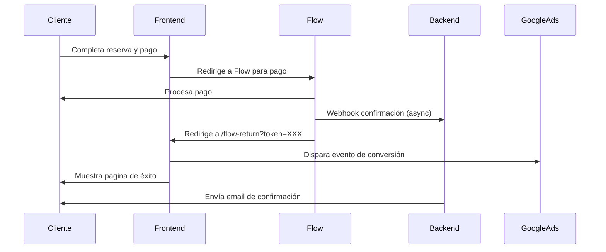

# Implementación de Seguimiento de Conversiones Google Ads

## 📋 Resumen

Sistema implementado para rastrear conversiones de Google Ads cuando un cliente completa un pago exitoso a través de Flow, permitiendo la medición precisa de campañas de marketing.

## 🎯 Objetivo

Disparar el evento de conversión de Google Ads (`AW-17529712870/yZz-CJqiicUbEObh6KZB`) cuando:
- Un cliente completa un pago con Flow exitosamente
- Ya sea desde el módulo principal (HeroExpress) o desde pago con código (PagarConCodigo)

## 🔄 Flujo de Implementación



## 📁 Archivos Modificados/Creados

### 1. **Nuevo: `src/components/FlowReturn.jsx`**

Componente que maneja la página de retorno después del pago con Flow.

**Características:**
- Extrae token de Flow de la URL (`?token=XXX`)
- Usa el token como `transaction_id` único para evitar duplicados
- Dispara evento de conversión Google Ads una sola vez
- Muestra UI de confirmación de pago exitoso
- Proporciona enlaces a página principal y WhatsApp

**Código de conversión:**
```javascript
gtag('event', 'conversion', {
    'send_to': 'AW-17529712870/yZz-CJqiicUbEObh6KZB',
    'value': 1.0,
    'currency': 'CLP',
    'transaction_id': token // Token único de Flow
});
```

### 2. **Modificado: `src/App.jsx`**

- Importado componente `FlowReturn`
- Agregada función `resolveIsFlowReturnView()` para detectar ruta `/flow-return`
- Agregado estado `isFlowReturnView` con sincronización de hash/pathname
- Renderizado condicional del componente cuando la ruta es `/flow-return`

**Código agregado:**
```javascript
// Resolver si la URL es la página de retorno de Flow
const resolveIsFlowReturnView = () => {
	const pathname = window.location.pathname.toLowerCase();
	const hash = window.location.hash.toLowerCase();
	return (
		pathname === "/flow-return" ||
		pathname.startsWith("/flow-return/") ||
		hash === "#flow-return"
	);
};

// useEffect para sincronizar vista
useEffect(() => {
	const syncFlowReturn = () =>
		setIsFlowReturnView(resolveIsFlowReturnView());
	window.addEventListener("hashchange", syncFlowReturn);
	window.addEventListener("popstate", syncFlowReturn);
	return () => {
		window.removeEventListener("hashchange", syncFlowReturn);
		window.removeEventListener("popstate", syncFlowReturn);
	};
}, []);

// Renderizado condicional
if (isFlowReturnView) {
	return <FlowReturn />;
}
```

## 🔧 Configuración Backend (Sin cambios)

El backend ya estaba configurado correctamente:

**Archivo: `backend/server-db.js`**
- Endpoint `/create-payment` línea ~5650
- `urlReturn` configurado como: `${frontendBase}/flow-return`
- Webhook de Flow en `/api/flow-confirmation` línea ~5788
- El webhook actualiza la BD y envía emails al confirmarse el pago

## 🌐 Configuración de Hosting (Sin cambios)

El archivo `.htaccess` ya tiene SPA fallback routing:

```apache
# SPA fallback: route everything else to index.html
RewriteRule . /index.html [L]
```

Esto permite que `/flow-return` sea servido por `index.html` y manejado por React.

## ✅ Validaciones Implementadas

1. **Evitar duplicados:**
   - Se usa el token de Flow como `transaction_id`
   - Google Ads ignora conversiones duplicadas con el mismo `transaction_id`

2. **Disparar solo en pago exitoso:**
   - El evento solo se dispara si el usuario llega a `/flow-return`
   - Flow solo redirige ahí cuando el pago es exitoso

3. **Compatibilidad:**
   - Funciona con todos los flujos de pago (HeroExpress, PagarConCodigo)
   - Ambos usan el mismo endpoint `/create-payment`

## 🧪 Pruebas Necesarias

### Prueba 1: Pago desde HeroExpress
1. Ir a la página principal
2. Completar formulario de reserva
3. Seleccionar "Pagar con Flow"
4. Completar pago en Flow
5. **Verificar:** Redirige a `/flow-return?token=XXX`
6. **Verificar:** Se muestra página de éxito
7. **Verificar:** En consola aparece: "✅ Evento de conversión Google Ads disparado"
8. **Verificar:** En Google Ads se registra la conversión

### Prueba 2: Pago con Código
1. Ir a `#pagar-con-codigo`
2. Ingresar código válido
3. Completar datos y pagar con Flow
4. Completar pago en Flow
5. **Verificar:** Redirige a `/flow-return?token=XXX`
6. **Verificar:** Se muestra página de éxito
7. **Verificar:** Conversión registrada en Google Ads

### Prueba 3: Evitar Duplicados
1. Completar un pago exitoso
2. Copiar URL de `/flow-return?token=XXX`
3. Actualizar la página (F5)
4. **Verificar:** Google Ads NO cuenta conversión duplicada
5. Pegar la URL en nueva pestaña
6. **Verificar:** Google Ads NO cuenta conversión duplicada

## 📊 Monitoreo en Google Ads

Para verificar conversiones:

1. Ir a Google Ads → Herramientas → Conversiones
2. Buscar la conversión: `AW-17529712870/yZz-CJqiicUbEObh6KZB`
3. Ver estadísticas de conversiones por día
4. Verificar que `transaction_id` esté poblado

## 🔐 Seguridad

- No se expone información sensible en la URL
- El token de Flow es temporal y de un solo uso
- El evento se dispara solo en frontend (HTTPS)
- No se envían datos personales a Google Ads

## 📝 Actualización del ID de Conversión

Si el equipo de marketing necesita cambiar el ID de conversión:

1. Editar `src/components/FlowReturn.jsx`
2. Cambiar línea ~42:
   ```javascript
   send_to: 'AW-XXXXXXXXXX/XXXXXXXXXX', // Nuevo ID aquí
   ```
3. Hacer build y deploy:
   ```bash
   npm run build
   ```

## 🚀 Despliegue

### Frontend (Hostinger)
1. Ejecutar build:
   ```bash
   npm run build
   ```
2. Subir contenido de carpeta `dist/` a Hostinger
3. Verificar que `.htaccess` esté presente

### Backend (Render.com)
- No requiere cambios
- Ya está configurado para redirigir a `/flow-return`

## 📚 Referencias

- Documentación Google Ads: [Event Snippets](https://support.google.com/google-ads/answer/7305793)
- Documentación Flow: [URL de Retorno](https://www.flow.cl/docs/api)
- Implementación similar: `src/components/FletesLanding.jsx` líneas 164-170

## ✨ Mejoras Futuras (Opcionales)

1. **Valor dinámico de conversión:**
   - Pasar el monto real del pago en el campo `value`
   - Requiere modificar backend para incluir monto en URL de retorno

2. **Múltiples tipos de conversión:**
   - Diferentes IDs para abono vs. pago total
   - Diferentes IDs por origen (HeroExpress vs. PagarConCodigo)

3. **Analytics mejorado:**
   - Enviar eventos adicionales a Google Analytics
   - Tracking del embudo completo de conversión

4. **Dashboard de conversiones:**
   - Panel en admin para ver conversiones registradas
   - Comparar con pagos en BD

## 👥 Soporte

Para problemas con conversiones:
1. Revisar consola del navegador (F12)
2. Verificar que gtag esté cargado: `console.log(typeof gtag)`
3. Revisar URL de retorno: debe ser `/flow-return?token=XXX`
4. Verificar en Google Ads Tag Assistant
5. Contactar equipo de desarrollo

---

**Implementado:** 2025-01-23  
**Autor:** GitHub Copilot  
**Versión:** 1.0
