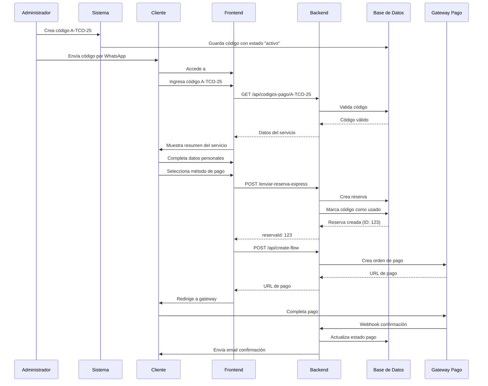

# Sistema de Códigos de Pago Estandarizados

## 📋 Resumen

Sistema completo para gestionar cobros mediante códigos únicos entregados por WhatsApp. Permite a los clientes validar códigos (ej: A-TCO-25) y completar el pago directamente en la web.

## 🎯 Características Principales

### Para el Cliente
- ✅ Validación de código desde la web
- ✅ Visualización del resumen del servicio y monto
- ✅ Formulario simplificado de datos personales
- ✅ Pago inmediato con Flow o MercadoPago
- ✅ Generación automática de reserva después del pago

### Para el Administrador
- ✅ Panel de gestión de códigos de pago
- ✅ Creación de códigos personalizados
- ✅ Control de usos y vencimientos
- ✅ Seguimiento de códigos activos/usados/vencidos
- ✅ Asociación automática con reservas

## 🗄️ Estructura de Base de Datos

### Tabla: `codigos_pago`

```sql
CREATE TABLE codigos_pago (
    id INT AUTO_INCREMENT PRIMARY KEY,
    codigo VARCHAR(50) NOT NULL UNIQUE,
    origen VARCHAR(255) NOT NULL,
    destino VARCHAR(255) NOT NULL,
    monto DECIMAL(10, 2) NOT NULL,
    descripcion TEXT,
    vehiculo VARCHAR(100),
    pasajeros INT DEFAULT 1,
    ida_vuelta BOOLEAN DEFAULT FALSE,
    estado ENUM('activo', 'usado', 'vencido', 'cancelado') DEFAULT 'activo',
    fecha_vencimiento DATETIME,
    usos_maximos INT DEFAULT 1,
    usos_actuales INT DEFAULT 0,
    reserva_id INT,
    email_cliente VARCHAR(255),
    fecha_uso DATETIME,
    observaciones TEXT,
    created_at DATETIME NOT NULL DEFAULT CURRENT_TIMESTAMP,
    updated_at DATETIME NOT NULL DEFAULT CURRENT_TIMESTAMP ON UPDATE CURRENT_TIMESTAMP,
    
    INDEX idx_codigo (codigo),
    INDEX idx_estado (estado),
    INDEX idx_fecha_vencimiento (fecha_vencimiento),
    INDEX idx_reserva_id (reserva_id),
    INDEX idx_email_cliente (email_cliente)
) ENGINE=InnoDB DEFAULT CHARSET=utf8mb4;
```

### Campos Principales

| Campo | Tipo | Descripción |
|-------|------|-------------|
| `codigo` | VARCHAR(50) | Código único (ej: A-TCO-25) |
| `origen` | VARCHAR(255) | Origen del traslado |
| `destino` | VARCHAR(255) | Destino del traslado |
| `monto` | DECIMAL(10,2) | Monto en pesos chilenos |
| `estado` | ENUM | activo, usado, vencido, cancelado |
| `usos_maximos` | INT | Número máximo de usos permitidos |
| `usos_actuales` | INT | Número de veces usado |
| `reserva_id` | INT | ID de la reserva creada |

## 🔌 API Endpoints

### 1. Crear Código de Pago (Admin)

**Endpoint:** `POST /api/codigos-pago`

**Autenticación:** Bearer Token (Admin)

**Body:**
```json
{
  "codigo": "A-TCO-25",
  "origen": "Aeropuerto Temuco",
  "destino": "Temuco Centro",
  "monto": 25000,
  "descripcion": "Traslado privado aeropuerto a Temuco",
  "vehiculo": "Sedan",
  "pasajeros": 4,
  "idaVuelta": false,
  "fechaVencimiento": "2025-12-31T23:59:59",
  "usosMaximos": 1,
  "observaciones": "Código para cliente VIP"
}
```

**Respuesta Exitosa:**
```json
{
  "success": true,
  "codigoPago": {
    "id": 1,
    "codigo": "A-TCO-25",
    "origen": "Aeropuerto Temuco",
    "destino": "Temuco Centro",
    "monto": "25000.00",
    "estado": "activo",
    "createdAt": "2025-10-16T00:00:00.000Z"
  }
}
```

### 2. Validar Código de Pago (Público)

**Endpoint:** `GET /api/codigos-pago/:codigo`

**Autenticación:** No requerida

**Ejemplo:** `GET /api/codigos-pago/A-TCO-25`

**Respuesta Exitosa:**
```json
{
  "success": true,
  "codigoPago": {
    "codigo": "A-TCO-25",
    "origen": "Aeropuerto Temuco",
    "destino": "Temuco Centro",
    "monto": "25000.00",
    "descripcion": "Traslado privado aeropuerto a Temuco",
    "vehiculo": "Sedan",
    "pasajeros": 4,
    "idaVuelta": false,
    "estado": "activo"
  }
}
```

**Respuesta Error (Código no válido):**
```json
{
  "success": false,
  "message": "Código de pago no encontrado"
}
```

**Respuesta Error (Código usado):**
```json
{
  "success": false,
  "message": "El código está usado",
  "estado": "usado"
}
```

### 3. Marcar Código como Usado (Interno)

**Endpoint:** `PUT /api/codigos-pago/:codigo/usar`

**Autenticación:** No requerida (se llama automáticamente)

**Body:**
```json
{
  "reservaId": 123,
  "emailCliente": "cliente@email.com"
}
```

**Respuesta:**
```json
{
  "success": true,
  "message": "Código marcado como usado",
  "codigoPago": {
    "codigo": "A-TCO-25",
    "estado": "usado",
    "usosActuales": 1,
    "usosMaximos": 1,
    "reservaId": 123,
    "emailCliente": "cliente@email.com",
    "fechaUso": "2025-10-16T10:30:00.000Z"
  }
}
```

### 4. Listar Códigos de Pago (Admin)

**Endpoint:** `GET /api/codigos-pago`

**Autenticación:** Bearer Token (Admin)

**Query Params:**
- `estado` (opcional): activo, usado, vencido, cancelado
- `page` (opcional): Número de página (default: 1)
- `limit` (opcional): Resultados por página (default: 50)

**Ejemplo:** `GET /api/codigos-pago?estado=activo&page=1&limit=20`

**Respuesta:**
```json
{
  "success": true,
  "codigosPago": [
    {
      "id": 1,
      "codigo": "A-TCO-25",
      "origen": "Aeropuerto Temuco",
      "destino": "Temuco Centro",
      "monto": "25000.00",
      "estado": "activo",
      "usosActuales": 0,
      "usosMaximos": 1,
      "createdAt": "2025-10-16T00:00:00.000Z"
    }
  ],
  "pagination": {
    "total": 1,
    "page": 1,
    "limit": 20,
    "totalPages": 1
  }
}
```

### 5. Actualizar Código de Pago (Admin)

**Endpoint:** `PUT /api/codigos-pago/:codigo`

**Autenticación:** Bearer Token (Admin)

**Body:**
```json
{
  "estado": "cancelado",
  "observaciones": "Cliente canceló el servicio"
}
```

### 6. Eliminar Código de Pago (Admin)

**Endpoint:** `DELETE /api/codigos-pago/:codigo`

**Autenticación:** Bearer Token (Admin)

**Respuesta:**
```json
{
  "success": true,
  "message": "Código de pago eliminado correctamente"
}
```

## 🖥️ Componentes Frontend

### 1. PagarConCodigo (Cliente)

**Ruta:** `/#pagar-codigo` o `/#codigo-pago`

**Flujo:**
1. Cliente ingresa el código recibido por WhatsApp
2. Sistema valida el código contra la API
3. Se muestra resumen del servicio (origen, destino, monto, etc.)
4. Cliente completa sus datos personales
5. Cliente selecciona método de pago (Flow o MercadoPago)
6. Se crea la reserva automáticamente
7. Cliente es redirigido al gateway de pago

**Características:**
- ✅ Validación en tiempo real del código
- ✅ Resumen visual con toda la información
- ✅ Formulario con validaciones
- ✅ Integración con ambos gateways de pago
- ✅ Manejo de errores completo

### 2. AdminCodigosPago (Administrador)

**Ruta:** `/#admin?panel=codigos-pago`

**Funcionalidades:**
- ✅ Crear nuevos códigos de pago
- ✅ Listar todos los códigos
- ✅ Filtrar por estado
- ✅ Ver detalles completos
- ✅ Eliminar códigos (si no están usados)
- ✅ Ver asociación con reservas

**Interfaz:**
- Tabla con todos los códigos
- Badges de estado (Activo, Usado, Vencido)
- Modal para crear código
- Validaciones en formulario
- Feedback visual de todas las operaciones

## 🔄 Flujo Completo del Sistema



## 📝 Formato de Códigos

### Convención Sugerida

```
[Origen]-[Destino]-[Monto]
```

**Ejemplos:**
- `A-TCO-25` = Aeropuerto a Temuco por $25.000
- `A-VLL-35` = Aeropuerto a Villarrica por $35.000
- `P-TCO-30` = Pucón a Temuco por $30.000
- `TCO-A-25` = Temuco a Aeropuerto por $25.000
- `A-TCO-35520` = Aeropuerto a Temuco por $35.520 (montos no cerrados)

**Prefijos Comunes:**
- `A` = Aeropuerto
- `TCO` = Temuco
- `VLL` = Villarrica
- `P` = Pucón
- `M` = Malalcahuello
- `L` = Lonquimay

### Flexibilidad

El sistema permite cualquier formato de código y **soporta montos cerrados y no cerrados** (por ejemplo: $25.000 o $35.520). Se recomienda usar códigos descriptivos y fáciles de comunicar por teléfono.

El sistema permite cualquier formato de código, pero se recomienda usar códigos descriptivos y fáciles de comunicar por teléfono.

## 🔐 Seguridad

### Validaciones Backend

1. **Código Único:** No se pueden crear códigos duplicados
2. **Estado:** Solo códigos activos pueden ser validados
3. **Vencimiento:** Se verifica automáticamente la fecha de vencimiento
4. **Usos Máximos:** Se controla el número de usos permitidos
5. **Autenticación Admin:** Endpoints administrativos requieren token

### Validaciones Frontend

1. **Formato de Email:** Validación con regex
2. **Campos Requeridos:** Nombre, email, teléfono obligatorios
3. **Monto Positivo:** No se permiten montos negativos o cero
4. **Feedback Visual:** Errores claros para el usuario

## 🧪 Pruebas

### Prueba Manual del Flujo Completo

1. **Crear código de pago:**
```bash
curl -X POST http://localhost:3001/api/codigos-pago \
  -H "Content-Type: application/json" \
  -H "Authorization: Bearer admin-secret-token" \
  -d '{
    "codigo": "TEST-001",
    "origen": "Aeropuerto Temuco",
    "destino": "Temuco Centro",
    "monto": 25000,
    "vehiculo": "Sedan",
    "pasajeros": 2
  }'
```

2. **Validar código:**
```bash
curl http://localhost:3001/api/codigos-pago/TEST-001
```

3. **Acceder a la página de pago:**
   - Abrir navegador en `http://localhost:5173/#pagar-codigo`
   - Ingresar código `TEST-001`
   - Verificar que se muestra el resumen
   - Completar datos y probar flujo de pago

4. **Verificar en panel admin:**
   - Ir a `http://localhost:5173/#admin?panel=codigos-pago`
   - Verificar que el código aparece como "usado"
   - Verificar que tiene asociada una reserva

## 🚀 Despliegue

### Variables de Entorno Requeridas

**Backend (Render.com):**
```env
# Base de datos
DATABASE_HOST=...
DATABASE_USER=...
DATABASE_PASSWORD=...
DATABASE_NAME=...

# Autenticación admin
ADMIN_TOKEN=tu-token-seguro-aqui

# Gateways de pago
MERCADOPAGO_ACCESS_TOKEN=...
FLOW_API_KEY=...
FLOW_SECRET_KEY=...

# URLs
BACKEND_URL=https://tu-backend.onrender.com
PHP_EMAIL_URL=https://www.transportesaraucaria.cl/enviar_correo_mejorado.php
```

**Frontend (Hostinger):**
```env
VITE_BACKEND_URL=https://tu-backend.onrender.com
VITE_ADMIN_TOKEN=tu-token-seguro-aqui
```

### Migración de Base de Datos

La tabla `codigos_pago` se crea automáticamente al iniciar el servidor backend. La migración está en:

```
backend/migrations/add-codigos-pago-table.js
```

Se ejecuta automáticamente en `initializeDatabase()`.

## 📊 Monitoreo

### Logs Importantes

**Creación de código:**
```
✅ Código de pago creado: A-TCO-25
```

**Validación de código:**
```
📋 Validando código de pago: A-TCO-25
✅ Código válido: activo
```

**Uso de código:**
```
📋 Marcando código de pago como usado: A-TCO-25
✅ Código de pago actualizado: A-TCO-25 (usos: 1/1)
```

### Errores Comunes

**Error: "Código de pago no encontrado"**
- El código no existe en la base de datos
- Verificar que el código fue creado correctamente

**Error: "El código está usado"**
- El código ya fue utilizado el máximo de veces
- Crear un nuevo código para el cliente

**Error: "El código ha vencido"**
- La fecha de vencimiento ha pasado
- Actualizar la fecha o crear nuevo código

## 🔧 Mantenimiento

### Limpiar Códigos Vencidos

Para actualizar manualmente códigos vencidos:

```sql
UPDATE codigos_pago 
SET estado = 'vencido' 
WHERE estado = 'activo' 
  AND fecha_vencimiento IS NOT NULL 
  AND fecha_vencimiento < NOW();
```

### Reportes Útiles

**Códigos activos:**
```sql
SELECT codigo, origen, destino, monto, created_at 
FROM codigos_pago 
WHERE estado = 'activo' 
ORDER BY created_at DESC;
```

**Códigos más usados:**
```sql
SELECT codigo, usos_actuales, usos_maximos, 
       COUNT(*) as total_reservas
FROM codigos_pago 
WHERE estado = 'usado'
GROUP BY codigo 
ORDER BY total_reservas DESC;
```

## 📞 Soporte

Para problemas con el sistema de códigos de pago:

1. Verificar logs del backend en Render
2. Verificar que la migración se ejecutó correctamente
3. Probar endpoints directamente con curl
4. Revisar panel admin para estado de códigos
5. Contactar soporte técnico si persiste el problema

---

**Fecha de Implementación:** 16 de octubre de 2025  
**Versión:** 1.0.0  
**Estado:** ✅ Implementado y listo para producción
