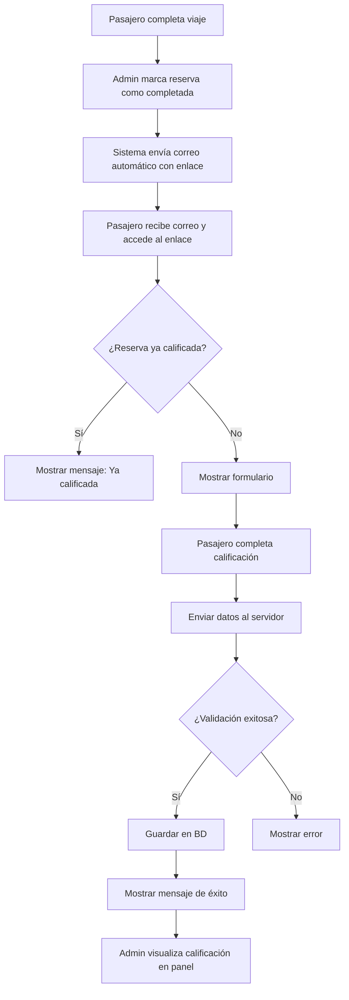

# Sistema de Calificación del Servicio

## 📋 Descripción General

El Sistema de Calificación del Servicio permite a los pasajeros evaluar su experiencia después de completar un viaje con Transportes Araucanía. Este sistema recopila feedback valioso sobre diferentes aspectos del servicio, ayudando a mantener y mejorar la calidad del servicio.

**✨ Envío automático de correos:** El sistema envía automáticamente un correo electrónico al pasajero cuando una reserva se marca como "completada", solicitando su calificación con un enlace personalizado.

## 🎯 Características Principales

### Para Pasajeros
- **Recepción automática de correo** con enlace de calificación
- Calificación general del servicio (1-5 estrellas) - **OBLIGATORIO**
- Calificación de aspectos específicos (opcional):
  - Puntualidad
  - Limpieza del vehículo
  - Amabilidad del conductor
  - Calidad de la conducción
- Comentario libre (hasta 500 caracteres) - **OPCIONAL**
- Acceso directo mediante enlace único
- Sin necesidad de inicio de sesión

### Para Administradores
- **Envío automático de correos** al completar reservas
- Dashboard con estadísticas generales
- Visualización de todas las calificaciones
- Filtros y paginación
- Promedios por aspecto
- Identificación de áreas de mejora

## 🔄 Flujo del Sistema



## 📊 Estructura de Datos

### Tabla: Calificaciones

| Campo | Tipo | Descripción |
|-------|------|-------------|
| `id` | INTEGER | ID único (Primary Key) |
| `reserva_id` | INTEGER | ID de la reserva (Foreign Key, UNIQUE) |
| `puntuacion` | INTEGER | Calificación general (1-5) |
| `comentario` | TEXT | Comentario opcional (máx 500 caracteres) |
| `aspectos` | JSON | Calificaciones detalladas por aspecto |
| `fecha_calificacion` | DATETIME | Fecha y hora de la calificación |
| `ip_cliente` | VARCHAR(45) | IP del cliente |
| `dispositivo` | VARCHAR(100) | User agent del dispositivo |

### Estructura JSON de aspectos

```json
{
  "puntualidad": 5,
  "limpieza": 4,
  "amabilidad": 5,
  "conduccion": 5
}
```

## 🔌 Endpoints del API

### 1. Verificar si existe calificación

**GET** `/api/calificaciones/:reservaId`

**Descripción:** Verifica si una reserva ya ha sido calificada.

**Parámetros:**
- `reservaId` (path): ID de la reserva

**Respuesta exitosa (200):**
```json
{
  "success": true,
  "exists": false,
  "reserva": {
    "id": 123,
    "codigoReserva": "AR-20260208-0001",
    "origen": "Temuco",
    "destino": "Aeropuerto",
    "estado": "completada"
  }
}
```

**Respuesta si ya existe (200):**
```json
{
  "success": true,
  "exists": true,
  "calificacion": {
    "id": 1,
    "puntuacion": 5,
    "comentario": "Excelente servicio",
    "aspectos": {...},
    "reserva": {...}
  }
}
```

### 2. Crear nueva calificación

**POST** `/api/calificaciones`

**Descripción:** Crea una nueva calificación para una reserva.

**Headers:**
- `Content-Type: application/json`

**Body:**
```json
{
  "reservaId": 123,
  "puntuacion": 5,
  "comentario": "Excelente servicio, muy puntual",
  "aspectos": {
    "puntualidad": 5,
    "limpieza": 5,
    "amabilidad": 5,
    "conduccion": 5
  },
  "ipCliente": "192.168.1.1",
  "dispositivo": "Mozilla/5.0..."
}
```

**Validaciones:**
- `reservaId` y `puntuacion` son obligatorios
- `puntuacion` debe estar entre 1 y 5
- `comentario` máximo 500 caracteres
- La reserva debe existir
- La reserva debe estar en estado "completada"
- No debe existir calificación previa

**Respuesta exitosa (201):**
```json
{
  "success": true,
  "calificacion": {
    "id": 1,
    "reserva_id": 123,
    "puntuacion": 5,
    "comentario": "Excelente servicio",
    "aspectos": {...},
    "fecha_calificacion": "2026-02-08T16:30:00.000Z"
  },
  "message": "Calificación registrada exitosamente"
}
```

**Errores comunes:**
- `400`: Datos inválidos o faltantes
- `404`: Reserva no encontrada
- `409`: Reserva ya calificada
- `500`: Error del servidor

### 3. Listar calificaciones (Admin)

**GET** `/api/admin/calificaciones`

**Descripción:** Lista todas las calificaciones con paginación.

**Headers:**
- `Authorization: Bearer {token}`

**Query Parameters:**
- `minPuntuacion` (optional): Filtrar por puntuación mínima
- `maxPuntuacion` (optional): Filtrar por puntuación máxima
- `page` (optional): Número de página (default: 1)
- `limit` (optional): Resultados por página (default: 20)

**Respuesta exitosa (200):**
```json
{
  "success": true,
  "calificaciones": [
    {
      "id": 1,
      "puntuacion": 5,
      "comentario": "Excelente servicio",
      "aspectos": {...},
      "fecha_calificacion": "2026-02-08T16:30:00.000Z",
      "reserva": {
        "id": 123,
        "codigoReserva": "AR-20260208-0001",
        "nombre": "Juan Pérez",
        "email": "juan@example.com",
        "origen": "Temuco",
        "destino": "Aeropuerto",
        "fecha": "2026-02-08",
        "estado": "completada"
      }
    }
  ],
  "pagination": {
    "total": 50,
    "page": 1,
    "limit": 20,
    "totalPages": 3
  }
}
```

### 4. Obtener estadísticas (Admin)

**GET** `/api/admin/calificaciones/estadisticas`

**Descripción:** Retorna estadísticas agregadas de las calificaciones.

**Headers:**
- `Authorization: Bearer {token}`

**Respuesta exitosa (200):**
```json
{
  "success": true,
  "estadisticas": {
    "total_calificaciones": 50,
    "promedio_general": 4.56,
    "cinco_estrellas": 30,
    "cuatro_estrellas": 15,
    "tres_estrellas": 4,
    "bajo_dos_estrellas": 1,
    "promedios_aspectos": {
      "puntualidad": 4.7,
      "limpieza": 4.5,
      "amabilidad": 4.8,
      "conduccion": 4.6
    },
    "conteo_aspectos": {
      "puntualidad": 45,
      "limpieza": 44,
      "amabilidad": 46,
      "conduccion": 43
    }
  }
}
```

## 🎨 Componentes Frontend

### CalificarServicio.jsx

Componente público para que los pasajeros califiquen su servicio.

**Ubicación:** `/src/components/CalificarServicio.jsx`

**URL de acceso:** `https://www.transportesaraucaria.cl/#calificar?reserva=123`

**Estados:**
- `loading`: Cargando datos iniciales
- `error`: Error al cargar (reserva inválida, etc.)
- `yaCalificada`: La reserva ya fue calificada
- `formulario`: Formulario activo para calificar
- `exitoso`: Calificación enviada exitosamente

**Características:**
- Diseño responsive con gradiente azul/índigo
- Sistema de estrellas interactivo con hover effect
- Validación de campos
- Captura de dispositivo (user agent)

### AdminCalificaciones.jsx

Panel administrativo para visualizar y analizar calificaciones.

**Ubicación:** `/src/components/AdminCalificaciones.jsx`

**Acceso:** Panel Admin → Operaciones → Calificaciones

**Características:**
- 4 tarjetas con métricas clave
- Lista de calificaciones recientes
- Visualización de aspectos específicos
- Paginación
- Loading states
- Diseño con Shadcn/UI

## 📧 Guía de Uso para Administradores

### 1. Completar un viaje

1. Ir a **Reservas** en el panel administrativo
2. Buscar la reserva completada
3. Cambiar el estado a **"Completada"**
4. Guardar cambios

### 2. Envío automático de correo de calificación

**El sistema envía automáticamente un correo al pasajero cuando se marca una reserva como "completada".**

#### Qué sucede automáticamente:

1. El administrador cambia el estado de la reserva a **"Completada"**
2. El sistema detecta el cambio de estado
3. Se envía automáticamente un correo al pasajero con:
   - Saludo personalizado con su nombre
   - Detalles de su viaje (código de reserva, ruta, fecha)
   - Enlace directo al formulario de calificación
   - Diseño atractivo y profesional

#### Template del correo enviado:

El correo incluye:
- **Asunto:** 🌟 ¿Cómo fue tu experiencia? - Transportes Araucanía
- **Contenido:** Mensaje personalizado con detalles del viaje
- **Botón principal:** "⭐ Calificar mi viaje" que lleva a `https://www.transportesaraucaria.cl/#calificar?reserva=ID`
- **Información:** Lista de aspectos que puede calificar

#### Requisitos para el envío automático:

- La reserva debe tener un email válido
- La reserva debe tener el nombre del pasajero
- El estado debe cambiar a "completada"

#### Configuración:

El sistema usa las siguientes variables de entorno:
- `FRONTEND_URL`: URL del frontend (default: https://www.transportesaraucaria.cl)
- `PHP_MAILER_URL`: URL donde está alojado el PHP (default: https://www.transportesaraucaria.cl)

**Nota:** El envío de correo no afecta la actualización del estado. Si el correo falla por alguna razón, la reserva se marca como completada de todas formas y se registra un mensaje en los logs.

#### Envío manual (opcional):

Si necesitas reenviar el enlace manualmente, usa:
```
https://www.transportesaraucania.cl/#calificar?reserva=[ID_RESERVA]
```


### 3. Ver calificaciones

1. Ir a **Panel Admin** → **Operaciones** → **Calificaciones**
2. Ver estadísticas generales en las tarjetas superiores
3. Revisar lista de calificaciones recientes
4. Usar paginación para navegar entre páginas

### 4. Analizar resultados

**Métricas clave:**
- **Promedio General**: Indica la satisfacción global
- **5 Estrellas**: Clientes muy satisfechos
- **Bajo 3 Estrellas**: Servicios que requieren atención

**Promedios por aspecto:**
- Identificar áreas fuertes y débiles
- Priorizar mejoras basadas en los datos
- Tomar acciones correctivas cuando sea necesario

### 5. Acciones basadas en feedback

**Calificaciones bajas (1-2 estrellas):**
1. Revisar el comentario para entender el problema
2. Contactar al pasajero si es necesario
3. Tomar acciones correctivas
4. Capacitar al personal si es requerido

**Calificaciones altas (4-5 estrellas):**
1. Reconocer y felicitar al equipo
2. Identificar buenas prácticas
3. Replicar el éxito en otros servicios

## 🔒 Consideraciones de Seguridad

### Validaciones Implementadas

1. **ID de reserva numérico:** Previene inyección de código
2. **Constraint único:** Una reserva solo puede ser calificada una vez
3. **Estado de reserva:** Solo se pueden calificar reservas completadas
4. **Longitud del comentario:** Máximo 500 caracteres
5. **Validación de puntuación:** Solo valores 1-5
6. **Uso de Sequelize:** Previene SQL injection
7. **Autenticación admin:** Los endpoints administrativos requieren JWT

### Recomendaciones Adicionales

1. **Rate limiting:** Considerar implementar límites de intentos
2. **CAPTCHA:** Agregar para prevenir spam (opcional)
3. **Logs de auditoría:** Registrar intentos sospechosos
4. **Sanitización de datos:** Ya implementada mediante Sequelize

## 🚀 Despliegue y Sincronización

### Backend (Render.com)

El modelo `Calificacion` se sincronizará automáticamente al iniciar el servidor:

```javascript
// En backend/server-db.js
await syncDatabase();
```

Esto creará la tabla `Calificaciones` en la base de datos MySQL.

### Frontend (Hostinger)

Los cambios en el frontend se desplegarán automáticamente al hacer push al repositorio.

## 📈 Métricas de Éxito

Para medir el éxito del sistema:

1. **Tasa de respuesta:** % de reservas completadas que reciben calificación
2. **Promedio general:** Mantener > 4.5 estrellas
3. **Distribución:** Mayoría en 4-5 estrellas
4. **Feedback accionable:** Usar comentarios para mejoras concretas

## 🔧 Mantenimiento

### Tareas Periódicas

- Revisar calificaciones semanalmente
- Analizar tendencias mensuales
- Responder a feedback negativo dentro de 48 horas
- Actualizar documentación si se agregan funcionalidades

### Respaldo de Datos

Las calificaciones se almacenan en la base de datos MySQL principal y se respaldan junto con todos los demás datos del sistema.

## 📞 Soporte

Para preguntas o problemas con el sistema de calificaciones:

- **Documentación técnica:** Este archivo
- **Código fuente:** `/backend/models/Calificacion.js`, `/src/components/CalificarServicio.jsx`
- **Issues:** GitHub Issues del repositorio

---

**Última actualización:** 8 de Febrero, 2026  
**Versión:** 1.0.0
