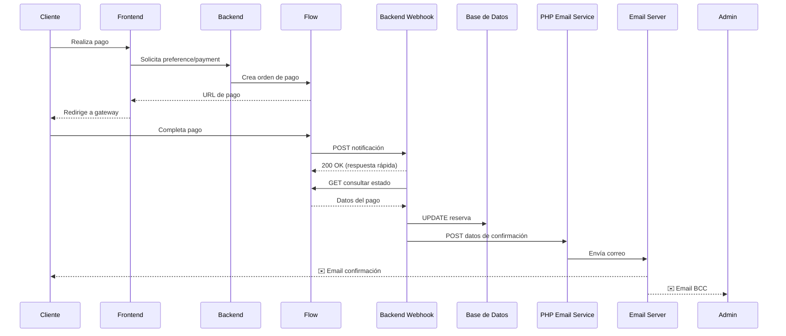

# Sistema de Notificaciones de Pago

## 📋 Resumen

Sistema completo de confirmación de pagos que actualiza automáticamente la base de datos y envía correos de notificación tanto al cliente como al administrador cuando se confirma un pago a través de Flow.

## 🎯 Componentes Implementados

### 1. **Archivo PHP para Correos** (`enviar_confirmacion_pago.php`)

Ubicación: `/enviar_confirmacion_pago.php` (en servidor Hostinger)

**Función:**
- Recibe datos del pago confirmado vía POST
- Envía correo HTML profesional al cliente
- Envía copia oculta (BCC) al administrador
- Incluye toda la información de la reserva y el pago

**Campos requeridos:**
```json
{
  "email": "cliente@example.com",
  "nombre": "Nombre Cliente",
  "codigoReserva": "AR-20250115-0001",
  "origen": "Temuco",
  "destino": "Aeropuerto Temuco",
  "fecha": "2025-01-20",
  "hora": "10:00",
  "pasajeros": 2,
  "vehiculo": "Sedan",
  "monto": 25000,
  "gateway": "flow",
  "paymentId": "12345678",
  "estadoPago": "approved"
}
```

**Email enviado incluye:**
- ✅ Código de reserva destacado
- 📋 Detalles completos de la reserva
- 💳 Información del pago (monto, método, ID transacción)
- 📌 Próximos pasos
- 📧 Información de contacto

### 2. **Webhooks de Pago** (Backend Node.js)

#### Webhook Flow (`/api/flow-confirmation`)

**Flujo:**
1. Flow envía confirmación POST con token
2. Consulta estado del pago en Flow API
3. Busca la reserva en la BD por email
4. Actualiza estado de pago en la reserva:
   - `estadoPago`: "aprobado"
   - `pagoId`: flowOrder
   - `pagoGateway`: "flow"
   - `pagoMonto`: Monto pagado
   - `pagoFecha`: Fecha del pago
   - `estado`: "confirmada" (si no está en pendiente_detalles)
5. Llama al PHP para enviar correo de confirmación

**Configuración requerida:**
```env
FLOW_API_KEY=tu_api_key
FLOW_SECRET_KEY=tu_secret_key
```

### 3. **Modelo de Reserva Actualizado**

Nuevos campos agregados al modelo `Reserva`:

```javascript
estadoPago: ENUM("pendiente", "aprobado", "pagado", "fallido", "reembolsado")
pagoId: STRING(255) - ID de transacción del gateway
pagoGateway: STRING(50) - Gateway utilizado (flow, transferencia, efectivo, otro)
pagoMonto: DECIMAL(10,2) - Monto pagado
pagoFecha: DATE - Fecha y hora del pago confirmado
```

### 4. **Migración Automática** (`add-payment-fields.js`)

**Ejecuta automáticamente al iniciar el servidor:**
- Verifica columnas existentes en la tabla `reservas`
- Agrega campos de pago faltantes:
  - `pago_id`
  - `pago_gateway`
  - `pago_monto`
  - `pago_fecha`
- Actualiza ENUM de `estado_pago` para incluir "aprobado"
- Crea índices para optimizar búsquedas:
  - `idx_pago_id`
  - `idx_estado_pago`

## 🔄 Flujo Completo de Pago



## 📧 Ejemplo de Email Enviado

**Asunto:** ✅ Pago Confirmado - Reserva AR-20250115-0001 - Transportes Araucaria

**Contenido:**
- Banner superior con código de reserva destacado
- Mensaje de confirmación con monto pagado
- Tabla de detalles de la reserva
- Tabla de detalles del pago
- Sección de próximos pasos
- Información de contacto
- Footer profesional

## 🔐 Seguridad

1. **Validación de webhooks:**
   - Flow: Usa firma HMAC-SHA256 con secret key

2. **Respuesta rápida:**
   - Webhooks responden inmediatamente "200 OK"
   - Procesamiento asíncrono para no bloquear

3. **Logs completos:**
   - Todos los eventos se registran en consola
   - Errores no críticos no bloquean el flujo

## 🧪 Pruebas

### Probar webhook Flow:
```bash
curl -X POST https://tu-backend.onrender.com/api/flow-confirmation \
  -H "Content-Type: application/json" \
  -d '{
    "token": "token_de_prueba"
  }'
```

### Probar envío de email directamente:
```bash
curl -X POST https://www.transportesaraucaria.cl/enviar_confirmacion_pago.php \
  -H "Content-Type: application/json" \
  -d '{
    "email": "tu@email.com",
    "nombre": "Test User",
    "codigoReserva": "AR-20250115-0001",
    "origen": "Temuco",
    "destino": "Aeropuerto",
    "fecha": "2025-01-20",
    "hora": "10:00",
    "pasajeros": 2,
    "vehiculo": "Sedan",
    "monto": 25000,
    "gateway": "Test",
    "paymentId": "TEST123",
    "estadoPago": "approved"
  }'
```

## 📊 Panel de Admin

El panel de administración muestra ahora:
- **Estado de Pago:** pendiente, aprobado, pagado, fallido, reembolsado
- **ID de Pago:** ID de transacción del gateway
- **Gateway:** flow, transferencia, efectivo, otro
- **Monto Pagado:** Monto de la transacción
- **Fecha de Pago:** Cuándo se confirmó el pago

## 🗑️ Archivos Eliminados

Los siguientes archivos obsoletos fueron eliminados:
- ✅ `actualizar_reserva_pago.php` (sistema antiguo basado en JSON)
- ✅ Sistema de `reservas_data.json` (reemplazado por MySQL)

## 🚀 Despliegue

1. **Subir PHP a Hostinger:**
   - Subir `enviar_confirmacion_pago.php` al directorio raíz

2. **Variables de entorno en Render:**
   ```env
   FLOW_API_KEY=...
   FLOW_SECRET_KEY=...
   BACKEND_URL=https://tu-backend.onrender.com
   PHP_EMAIL_URL=https://www.transportesaraucaria.cl/enviar_confirmacion_pago.php
   ```

3. **Configurar webhooks en gateways:**
   - **Flow:** La URL de confirmación se pasa al crear el pago

## ✅ Checklist de Implementación

- [x] Crear `enviar_confirmacion_pago.php`
- [x] Implementar webhook Flow funcional
- [x] Agregar campos de pago al modelo Reserva
- [x] Crear migración automática `add-payment-fields.js`
- [x] Integrar migración en inicialización del servidor
- [x] Eliminar archivos PHP obsoletos
- [x] Documentar sistema completo
- [ ] Subir PHP a Hostinger
- [ ] Probar flujo completo con pago real
- [ ] Verificar emails recibidos por cliente y admin

## 🔧 Mantenimiento

### Logs importantes:
```
✅ Reserva encontrada: ID X, Código AR-XXXXXXXX-XXXX
💾 Reserva actualizada con información de pago
📧 Enviando email de confirmación de pago...
✅ Email de confirmación de pago enviado
```

### Errores comunes:
- ❌ `Reserva no encontrada`: El webhook no pudo identificar la reserva
  - Verificar que external_reference o email sean correctos
- ❌ `Error al enviar email`: El PHP no respondió
  - Verificar URL de PHP en variables de entorno
  - Verificar conectividad a Hostinger

## 📞 Soporte

Si hay problemas con los pagos:
1. Revisar logs del webhook en Render
2. Verificar que el pago llegó al gateway (dashboard de MP o Flow)
3. Verificar que la reserva existe en la BD con el email correcto
4. Revisar logs de PHP en Hostinger (si están disponibles)
